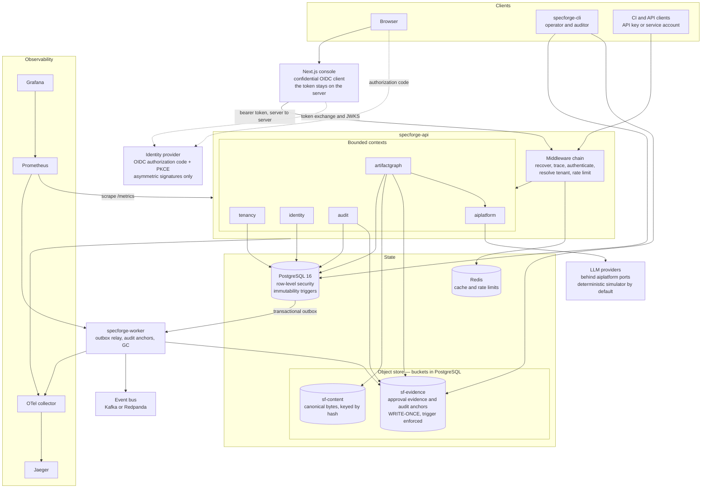
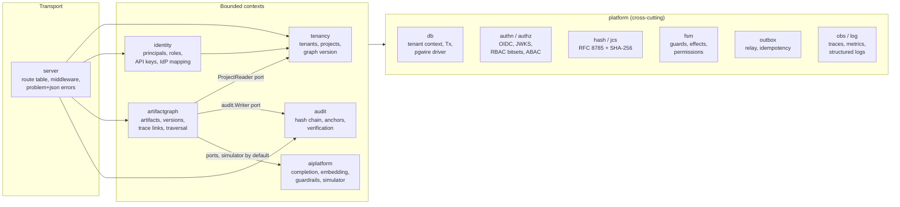
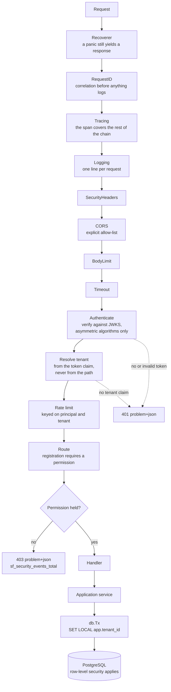
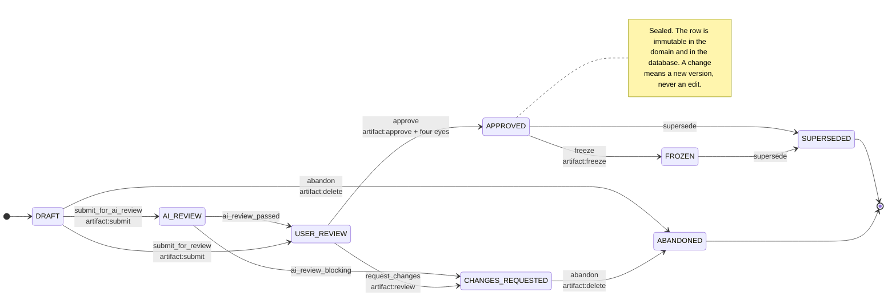
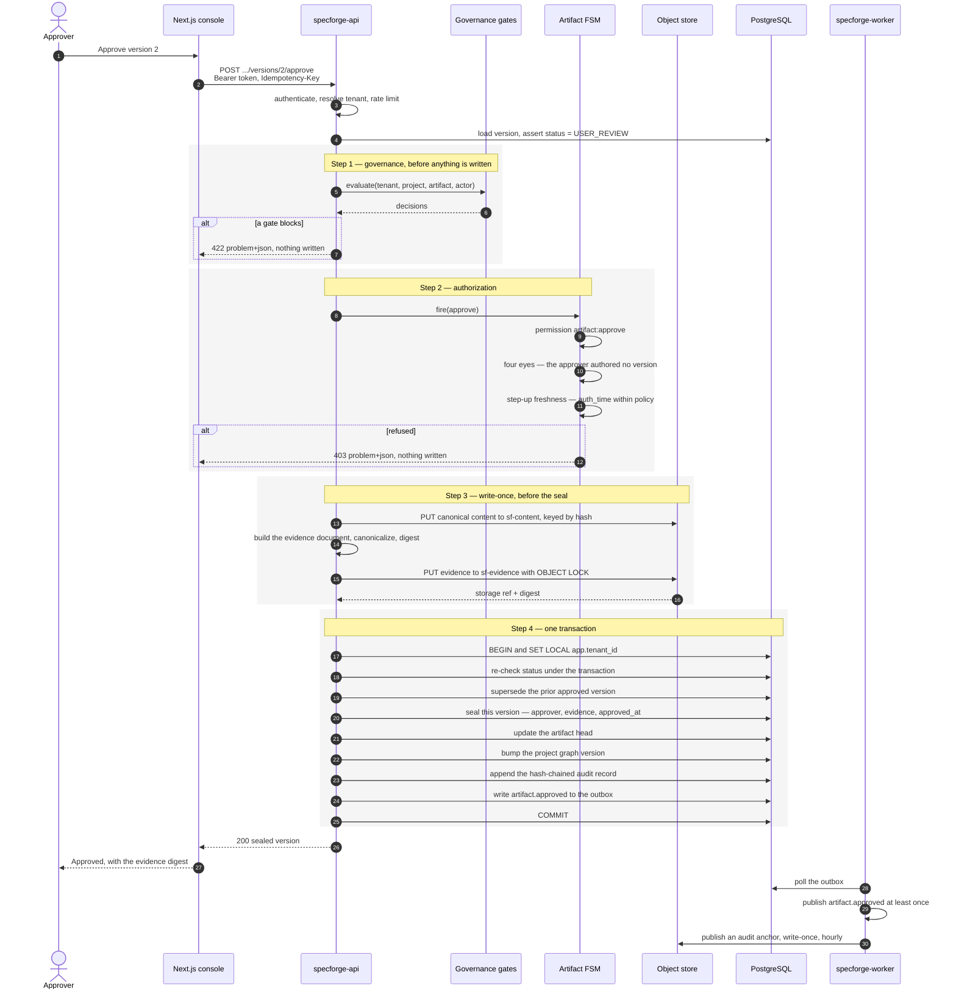
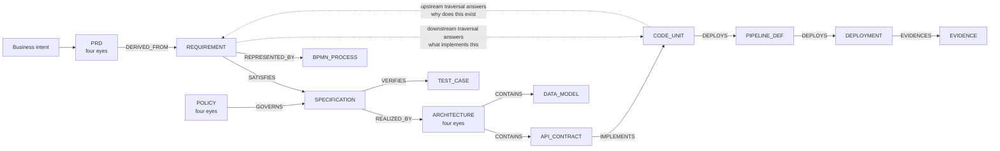
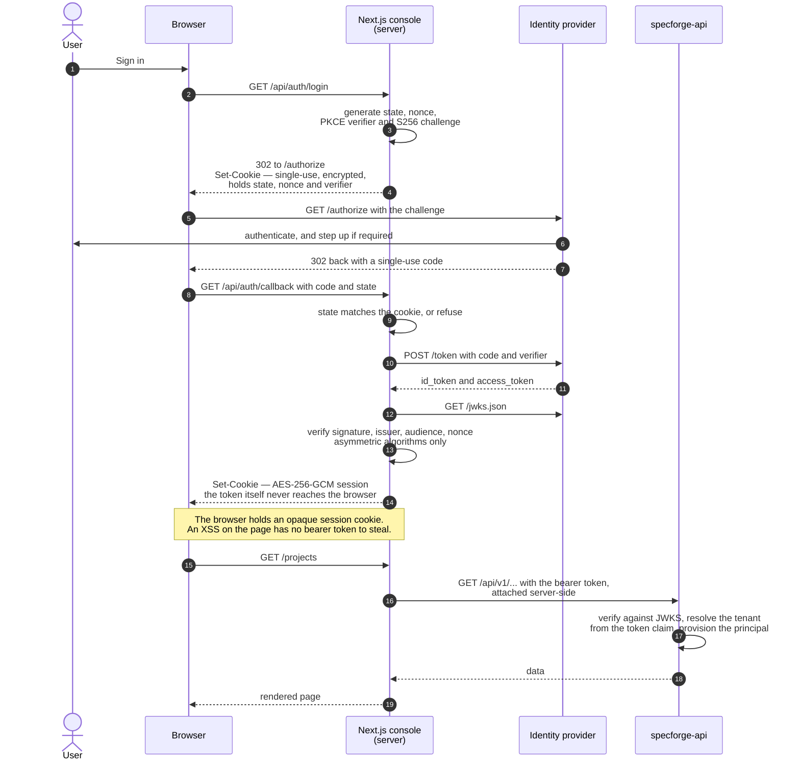
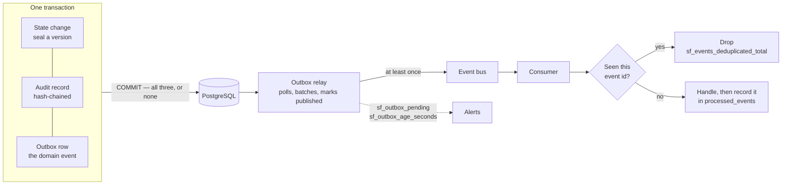
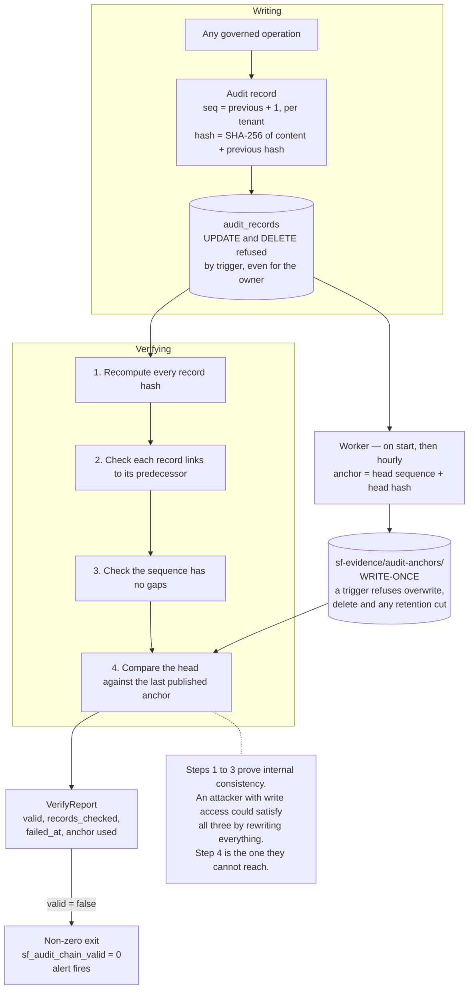
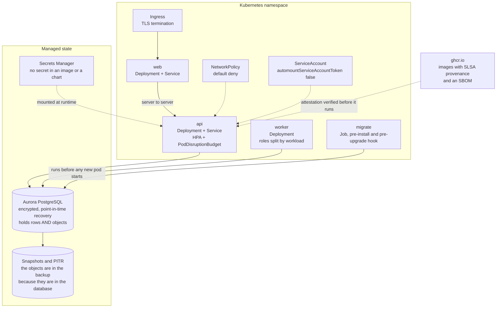

# SpecForge

A governed, traceable, AI-native platform for spec-driven software engineering.

SpecForge maintains a bidirectionally traceable graph running from business
intent through PRDs, specifications, process models, architecture, APIs, code,
tests and deployments — and it can answer, from data rather than from memory:

- **Why does this code exist?** — walk upstream to the approved requirement.
- **What implements this requirement?** — walk downstream to code and tests.
- **What breaks if this changes?** — a deterministic impact set, not a guess.
- **Who approved this, when, and on what evidence?** — a write-once evidence
  document and a hash-chained audit record.
- **Is what is running still what was approved?** — content hashes compared
  against a published anchor.

> **The platform is not an LLM wrapper.** Models propose. Deterministic systems
> parse, validate, version, authorize and record. The approved artifact model
> and the governance engine are authoritative, and no model output becomes fact
> without passing schema validation, policy gates and a human approval that is
> itself recorded as evidence.

---

## Contents

- [Quick start](#quick-start)
- [Architecture](#architecture)
  - [System context](#system-context)
  - [Modules and boundaries](#modules-and-boundaries)
  - [The request path](#the-request-path)
- [The canonical artifact model](#the-canonical-artifact-model)
  - [Content addressing](#content-addressing)
  - [The artifact lifecycle](#the-artifact-lifecycle)
  - [The approval path](#the-approval-path)
  - [Traceability](#traceability)
- [Identity, authentication and the console](#identity-authentication-and-the-console)
- [Authorization and separation of duties](#authorization-and-separation-of-duties)
- [Tenant isolation](#tenant-isolation)
- [Where objects live](#where-objects-live)
- [Events without dual writes](#events-without-dual-writes)
- [The audit trail](#the-audit-trail)
- [Where the AI sits](#where-the-ai-sits)
- [Observability](#observability)
- [Zero third-party Go dependencies](#zero-third-party-go-dependencies)
- [Deployment](#deployment)
- [Verification and testing](#verification-and-testing)
- [Configuration](#configuration)
- [Repository layout](#repository-layout)
- [Documentation](#documentation)
- [Status](#status)

---

## Quick start

Requirements: Docker with Compose, and Make. Go 1.24 and Node 22 if you intend
to run things outside containers.

```bash
make dev
```

That starts PostgreSQL, Redis, Redpanda, the OTel collector, Jaeger,
Prometheus and Grafana; applies the migrations; seeds a
worked example — an approved requirement, a specification derived from it, an
accepted trace link between them, and a verifiable audit chain — and wires the
development identity provider to the seeded tenant.

| Service       | URL                                                        |
| ------------- | ---------------------------------------------------------- |
| Console       | http://localhost:3000                                      |
| API           | http://localhost:8080                                      |
| Dev identity  | http://localhost:8081/.well-known/openid-configuration     |
| Grafana       | http://localhost:3001                                      |
| Jaeger        | http://localhost:16686                                     |
| Prometheus    | http://localhost:9091                                      |

Sign in as any of the twelve seeded roles. Start as **Analyst** to see a draft
move through review, then as **Owner** to approve it — the platform will refuse
to let the same person do both.

To check that all of it is actually working, and that the guarantees behind it
hold:

```bash
make smoke
```

It walks a real sign-in, calls the API as four different roles, confirms the
refusals are refusals, verifies the audit chain, and checks that traces and
metrics arrived. [docs/testing-the-local-stack.md](docs/testing-the-local-stack.md)
explains each check and how to run it by hand.

```bash
make token ROLE=analyst   # a real token, from a real authorization-code flow
make tenant-id            # the seeded tenant's id
make verify-audit TENANT=$(make -s tenant-id)
```

---

## Architecture

### System context

One API process, one worker process, one console, and state that is deliberately
boring. The interesting decisions are about which store holds what, and which
of them can be written twice.



Two paths on that diagram are worth reading twice.

**`specforge-cli` does not go through the API.** An auditor who wants to check
the audit chain reads the database and the evidence bucket directly and
recomputes the hashes themselves. If verification ran through the platform, it
would amount to asking the platform whether it had been honest.

**Nothing writes to the event bus and the database in the same operation.**
State changes and their events commit together, into PostgreSQL, and the worker
relays from there. There is no code path that can update a row and fail to emit
its event, or emit an event for a change that rolled back.

### Modules and boundaries

A modular monolith: one deployable, several bounded contexts, each with
`domain` / `app` / `infra` / `transport` layers. Cross-context calls go through
narrow interfaces that the *calling* context declares, so a module depends on
the shape it needs rather than on another module's implementation.



`artifactgraph` needs three things from the rest of the platform, and asks for
exactly three: a `ProjectReader` (can I see this project, and bump its graph
version), an `audit.Writer` (append this record inside my transaction), and a
`GateEvaluator` (is this approval permitted by policy). Phase 1 ships a
permissive gate evaluator; the interface exists now so the approval path already
routes through governance and does not have to be restructured when the policy
engine arrives.

The architecture is ready to split into services when there is a reason to. It
does not pay the cost of distribution before then.

### The request path

The middleware order is fixed and asserted by a test. Getting it wrong is a
security bug, not a style question: recovery must be outermost so a panic still
produces a response, and authorization must run after tenant resolution so it
has a tenant to compare against.



Three properties are structural rather than remembered:

- **The tenant comes from the token, not the path.** A request for
  `/tenants/{other}/projects` does not become a cross-tenant read by changing
  the URL; the path tenant is checked against the claim, and the database is
  scoped to the claim regardless.
- **A route cannot be registered without a permission.** `Route` takes one as a
  parameter, `PublicRoute` is the explicit exception, and `make lint-routes`
  fails the build if a handler ever reaches the mux another way. "We forgot to
  add authorization" is not a reachable state.
- **Errors are RFC 9457 problem+json**, with a stable `type` per failure kind,
  so a client can branch on the kind rather than on prose.

---

## The canonical artifact model

### Content addressing

Every artifact version is hashed as `SHA-256(JCS(envelope))` — RFC 8785
canonical JSON, so the hash is reproducible in any language that can canonicalize
JSON, not just by this codebase.

The envelope deliberately **excludes** `status`, the approval fields and trace
links. That exclusion is the whole point:

- The hash of an approved version is the hash of **exactly the bytes that were
  reviewed** — not of the review's outcome.
- The hash does not change as the version moves through its lifecycle, so
  "approved" and "frozen" and "superseded" are all the same content.
- Accepting a trace link does not alter the artifact it points at.

`SealApproval` asserts this rather than assuming it: it recomputes the hash at
seal time and refuses if it moved. Reads verify the stored hash before returning
content and fail closed on a mismatch, incrementing
`sf_content_hash_mismatch_total` — a metric whose correct value is always zero.

Sixteen artifact types are governed, each with a schema and an ID prefix:

| Type | Prefix | Four-eyes by default |
| ---- | ------ | -------------------- |
| `REQUIREMENT` | `REQ` | no |
| `PRD` | `PRD` | **yes** |
| `SPECIFICATION` | `SPEC` | no |
| `BPMN_PROCESS` | `BPMN` | no |
| `ARCHITECTURE` | `ARCH` | **yes** |
| `API_CONTRACT` | `API` | no |
| `DATA_MODEL` | `DATA` | no |
| `SEQUENCE` | `SEQ` | no |
| `STATE_MACHINE` | `FSM` | no |
| `CODE_UNIT` | `CODE` | no |
| `TEST_CASE` | `TEST` | no |
| `PIPELINE_DEF` | `PIPE` | no |
| `DEPLOYMENT` | `DEP` | no |
| `POLICY` | `POL` | **yes** |
| `EVIDENCE` | `EVD` | no |
| `PROMPT` | `PRM` | no |

Tenant policy may widen the four-eyes requirement. It can never narrow it below
the default.

### The artifact lifecycle

One state machine, shared by every artifact type. Each transition declares the
permission it requires, the guards that must hold, the domain event it emits and
the audit action it records — so a transition cannot be added without deciding
all four.



Note what is missing: there is **no edge back into `DRAFT`**. An artifact that
needs changing gets a new version — `Revise` copies the content forward, requires
a change summary, and starts at `DRAFT` with `previous_version` set. The old
version is left exactly as it was reviewed.

AI review sits *before* human review and is advisory. A blocking AI finding
routes to `CHANGES_REQUESTED`; a passing one routes to a human. Neither approves
anything.

Immutability is enforced twice. The domain seals the version; independently, a
database trigger compares the row minus its lifecycle columns and raises if
anything else moved. Partial unique indexes enforce one approved version per
artifact. Check constraints enforce that an approval has evidence, and that an
LLM-proposed trace link cannot be accepted without a recorded human disposition.

### The approval path

The most consequential code path in the platform. The ordering is deliberate,
and the reason for each step's position is in the diagram.



Four things about that ordering:

**Evidence is written before the row is sealed.** A crash between step 3 and
step 4 leaves an orphaned, content-addressed evidence object — harmless, and
garbage-collectable. The reverse ordering would leave an approval with no
evidence behind it, which is an approval you cannot defend.

**The status is re-checked inside the transaction.** Two approvers racing on the
same version is not a hypothetical; the second one gets a 409, not a second
approval.

**The prior version is superseded before this one is sealed**, so the partial
unique index never has to hold two approved rows even momentarily.

**One clock read.** `approved_at` is taken once and used for both the evidence
document and the sealed row. Two `time.Now()` calls would produce evidence that
disagrees with the record it is evidence for, by microseconds — which is exactly
the kind of discrepancy that makes an auditor stop trusting everything else.

### Traceability

Thirteen link types, each with a declared inverse, so every edge is traversable
in both directions.



Three queries are exposed, all bounded by `SF_LIMIT_MAX_GRAPH_DEPTH` so a
pathological graph cannot turn a traversal into an outage:

| Endpoint | Answers |
| -------- | ------- |
| `GET .../trace/upstream` | Why does this exist? |
| `GET .../trace/downstream` | What implements this? |
| `GET .../trace/impact` | What breaks if this changes? |

A link proposed by a model is created in `PROPOSED` and cannot reach `ACCEPTED`
without a recorded human disposition — enforced by a database constraint, not
only by application code.

---

## Identity, authentication and the console

The console is a server-rendered confidential OIDC client. The browser never
receives a bearer token.



- Only **asymmetric** signatures are accepted. `none` and the HMAC family are
  rejected outright, so a leaked client secret is not a token-forging key.
- The state, nonce and PKCE verifier live in one **single-use encrypted cookie**
  that is cleared on callback. A replayed callback fails.
- Principals are **provisioned just in time** from the token's claims, mapping
  IdP groups to platform roles. Concurrent first sign-ins race safely: the
  conflict is caught and the existing principal re-found.
- `Secure` on the session cookie is derived from the public URL, not from
  `NODE_ENV`. A production build served over loopback still signs you in; a
  production build served over plain HTTP anywhere else fails closed.

A **development identity provider** ships with the platform and is a real OIDC
provider: discovery, JWKS, PKCE with S256, single-use codes with a 60-second
lifetime, asymmetric signing. It refuses to start when `SF_ENV=production`, and
the configuration validator independently refuses a production configuration
that enables it. Two guards, because "we shipped the dev IdP" is a mistake
nobody makes twice but everybody makes once.

---

## Authorization and separation of duties

Twelve roles, sixty-nine permissions, held as bitsets so a check is a mask test
rather than a query.

| Role | Shape of it |
| ---- | ----------- |
| `platform_admin` | Tenant lifecycle, suspension, purge. **No permission to read or write any tenant's artifact content at all.** |
| `tenant_admin` | Administers one tenant — projects, principals, roles, API keys, IdP mapping. Cannot author or approve artifacts. |
| `product_owner` | Authors and approves PRDs, requirements and specifications. |
| `business_analyst` | Authors requirements, specifications and models. Submits and reviews; approves nothing. |
| `architect` | Authors and approves architecture, APIs and data models. Freezes baselines. Design Authority decisions. |
| `developer` | Authors code units, proposes links, runs sync, triggers pipelines. |
| `qa` | Authors test cases, reviews, runs scans. |
| `devops` | Pipelines, deployments, rollback, incidents. |
| `security` | Policies, guardrails, findings and suppression, exception grants. |
| `compliance` | Governance review, exception grants, evidence export. |
| `auditor` | Read-only across the tenant, including the audit trail and its export. |
| `viewer` | Read-only within assigned projects. |

The first row is the one that matters most. **Operating the platform and reading
a customer's intellectual property are different jobs**, so `platform_admin`
holds no artifact permission whatsoever — not read, not write. Access to
customer content by an operator goes through break-glass, which sets a database
session flag and is stamped on **every audit record that session produces**, so
the emergency is visible in the trail rather than indistinguishable from
ordinary work.

The matrix is a security control, and
[`internal/platform/authz/authz_test.go`](internal/platform/authz/authz_test.go)
is its specification: each role is asserted both for what it holds and for what
it must not hold, so widening a role by accident fails the build.

Authorization is layered, and no single layer is trusted alone:

1. **Route registration** demands a declared permission.
2. **RBAC** — the principal's role bitset must contain it.
3. **ABAC** — project scope, artifact type, and tenant policy.
4. **FSM guards** — the transition itself declares what it requires.
5. **Four-eyes** — an approver may not have authored *any* version of the
   artifact, not merely the one under review.
6. **Step-up freshness** — `auth_time` must be within
   `SF_AUTH_STEP_UP_MAX_AGE` for approval-class actions.
7. **Principal-class rules** — a service account cannot approve; an API key
   cannot hold an approval permission.
8. **Database constraints** — the last two rules again, as `CHECK` constraints,
   because an application bug should not be able to grant what policy forbids.

Rule 7 exists in two places on purpose. `make test-isolation` asserts the
database half directly, without going through the application, because the
application is the layer that guarantee is meant to survive.

---

## Tenant isolation

Row-level security with `FORCE ROW LEVEL SECURITY` on every tenant-scoped table,
keyed on a session variable set with `SET LOCAL` inside each transaction:

```sql
SET LOCAL app.tenant_id = '...';
```

`SET LOCAL` rather than `SET` is the important detail — the setting dies with
the transaction, so it cannot leak to the next borrower of a pooled connection.
The isolation suite proves that, rather than assuming it.

A **missing** tenant context returns zero rows, not every row. Policies compare
against `current_setting('app.tenant_id', true)`, which is `NULL` when unset, and
`tenant_id = NULL` matches nothing. The failure mode of forgetting to scope a
query is an empty result and a confused developer, not a data breach.

---

## Where objects live

Three kinds of blob exist: canonical artifact content, approval evidence, and
audit anchors. Two of the three must be write-once, and "write-once" has to be
a property of the store rather than a promise made by the code that writes to
it — evidence the application can overwrite is not evidence.

They are stored in PostgreSQL, in an `objects` table keyed by `(bucket, key)`.
Buckets and tenant-prefixed keys are exactly what a cloud object store would
use, so no application code knows the difference.

| Bucket        | Key prefix       | Holds                          | Locked |
| ------------- | ---------------- | ------------------------------ | ------ |
| `sf-content`  | `content/`       | canonical bytes, keyed by hash | no     |
| `sf-evidence` | `evidence/`      | approval evidence              | yes    |
| `sf-evidence` | `audit-anchors/` | audit chain anchors            | yes    |

Retention is enforced by a trigger, which refuses four things on a locked row:

- **overwriting it** — with one exception, a byte-identical rewrite, which is a
  no-op so that a retried approval does not fail merely for being a retry;
- **deleting it**;
- **shortening its retention** — the first move of anyone who wants to delete
  evidence and be able to say the retention had already expired;
- **releasing the lock**.

Because it is a trigger, an application bug, a stray migration and a direct
`psql` session all hit the same wall. `make test-isolation` asserts each of the
four directly against the database, as the table owner, which is a stronger
position than any attacker reaching the application would hold.

A second adapter stores objects on the local filesystem
(`SF_OBJSTORE_PROVIDER=fs`); it enforces the same rules in application code,
which is a weaker place to enforce them, and the configuration validator refuses
it in production for that reason. Both adapters are held to one conformance
suite, because the risk with two implementations of an interface is not that one
of them fails — it is that they quietly disagree.

There is no S3 adapter yet. `SF_OBJSTORE_PROVIDER=s3` is refused at startup with
a message naming what this build does support, rather than accepted and
discovered later.

## Events without dual writes

A state change, its audit record and its domain event commit in one transaction.
An operation that failed to record its audit entry could not have succeeded,
because the audit write is in the same transaction as the change it describes.



Delivery is **at least once**, which means consumers must be idempotent — so
they are, against a `processed_events` table. Exactly-once delivery is not
available across a database and a broker, and pretending otherwise pushes the
problem somewhere it will be discovered later and at a worse time.

`sf_outbox_age_seconds` is the signal that matters: a rising oldest-unpublished
age means the relay has stalled, and it rises before the pending count looks
alarming.

---

## The audit trail

Per-tenant, gapless sequences. Each record hashes its own content together with
its predecessor's hash.



Verification checks all three internal properties, not just hashes: checking
only record hashes would miss the wholesale deletion of a contiguous block, and
checking only linkage would miss a rewritten record whose neighbours were
rewritten too.

But internal consistency alone proves little, and the platform says so. The
report names the anchor it verified against, so nobody mistakes the weaker claim
("the chain is self-consistent") for the stronger one ("the chain matches what
was published an hour ago, to storage that cannot be overwritten").

The claim SpecForge makes is deliberately modest: **it does not claim records
cannot be altered by someone with sufficient access. It claims alteration cannot
be hidden.** A finding that breaks *detection* is more serious than one that
breaks *prevention*, and [SECURITY.md](SECURITY.md) says so explicitly.

---

## Where the AI sits

`internal/aiplatform` defines the ports — completion, embedding, moderation,
guardrails — and ships a deterministic local simulator that implements every one
of the eight prompt purposes. Real providers are adapters behind the same
interface, so the platform runs, and its tests pass, with no provider configured
and no network egress.

Three properties hold regardless of which provider is configured:

- A completion request carries a **prompt reference**, not raw text, so every
  generation is reproducible from a versioned `PROMPT` artifact.
- Generated content is **validated against a schema** before it can enter the
  graph, and carries the model, prompt version and guardrail chain version that
  produced it.
- A model-proposed trace link is created in `PROPOSED` and **cannot** reach
  `ACCEPTED` without a recorded human disposition — a database constraint, not
  only application code.

The AI review state exists in the lifecycle, and it is advisory. Its findings
route a version to `CHANGES_REQUESTED` or forward to a human. There is no edge
from AI review to `APPROVED`.

---

## Observability

Traces, metrics and logs share one correlation id, propagated as W3C trace
context, and the database spans carry the tenant id — which is how you confirm
from a trace that `SET LOCAL app.tenant_id` was applied on the connection that
ran the query.

The metrics that describe the platform's own integrity, rather than its traffic:

| Metric | Correct value |
| ------ | ------------- |
| `sf_audit_chain_valid` | `1` |
| `sf_content_hash_mismatch_total` | `0` |
| `sf_audit_last_anchor_timestamp_seconds` | within the last hour |
| `sf_outbox_age_seconds` | near zero |
| `sf_security_events_total` | non-zero is normal; a spike is not |

The provisioned Grafana dashboard is **SpecForge — Governance & Integrity**, and
the Prometheus alert rules in `deploy/docker/observability/alerts.yml` fire on
each of the above. Every alert references a metric that actually exists — there
is a test for that, because an alert on a misspelled metric is an alert that
never fires and a dashboard panel that is always empty.

---

## Zero third-party Go dependencies

`go.mod` has no `require` block. Everything is the standard library, including:

- a **PostgreSQL wire-protocol driver** (`internal/platform/db/pgwire`) with
  SCRAM-SHA-256 authentication, behind `database/sql`;
- a Redis client, a Prometheus text-format registry, W3C trace context and an
  OTLP/HTTP exporter;
- an RFC 8785 (JCS) canonicalizer;
- OIDC discovery, JWKS handling and RSA/ECDSA JWT verification.

This began as a constraint of the build environment and became a deliberate
choice worth keeping for a platform whose job is provenance: every line that
handles a tenant's specifications is in this repository and reviewable.
`make lint-deps` fails the build if `go.sum` is non-empty, so adding a dependency
is a decision somebody makes on purpose and defends in review.

The driver is confined behind `database/sql`. Swapping in pgx is a one-file
change behind a build tag.

---

## Deployment

Declarative only. Nothing creates infrastructure from application code.



- **Write-once retention comes from the database, not from a storage tier.**
  The evidence and anchor buckets are rows in `objects`, and migration 0005's
  trigger refuses to overwrite one, to delete one, to shorten its retention or
  to release its lock. The Terraform S3 module with Object Lock `COMPLIANCE` is
  still in the repository for a deployment that later wants a separate tier;
  the adapter for it is not written yet, and `SF_OBJSTORE_PROVIDER=s3` is
  refused at startup rather than accepted and quietly ignored.
- **The migration Job is a pre-install and pre-upgrade hook**, so schema changes
  land before any pod that assumes them starts.
- **The chart has preconditions that refuse unsafe values** — a production
  release with the development identity provider enabled, or with a session
  secret left at its default, fails at template time rather than at runtime.
- **The pod mounts no Kubernetes service-account token.** The platform
  authenticates to PostgreSQL, object storage and Kafka with their own
  credentials and has no reason to call the Kubernetes API; a mounted token is
  an unnecessary credential inside a process that handles untrusted content.
- **Images carry SLSA provenance and an SBOM.** A deployment can verify that an
  image was built by this repository's pipeline from a specific commit before
  running it:

  ```bash
  gh attestation verify oci://ghcr.io/<owner>/specforge-api:<version> --repo <owner>/specforge
  ```

---

## Verification and testing

The platform is built so that its claims can be checked without trusting it.

```bash
# Recompute every audit hash and compare against the published anchor.
make verify-audit TENANT=<tenant-id>

# Verify an exported approval offline. This never contacts the platform.
specforge-cli verify-evidence --file evidence.json --digest sha256:...
```

| Command | What it covers |
| ------- | -------------- |
| `make check` | gofmt, `go vet`, route lint, dependency lint, unit and contract tests |
| `make test-integration` | the forward journey, four-eyes, tenancy, tampering — against a real PostgreSQL |
| `make test-isolation` | 35 database invariants asserted directly in SQL |
| `make smoke` | a running stack, end to end, including the refusals |
| `make verify-release` | all of the above plus the chart/tag/binary version agreement |

`make test-isolation` is the one to run if you only run one. It asserts, in SQL
and without going through the application, that a tenant cannot read another
tenant's rows, that an approved version cannot be modified or deleted **even by
the table owner**, that an audit record cannot be updated, that a locked
evidence object cannot be overwritten, deleted or have its retention shortened,
and that an API key cannot hold an approval permission.

The contract test holds `api/openapi/specforge.v1.yaml` against the live route
table — every path, method, permission and enum. It has been mutation-tested:
break the document and the test fails, which is the only way to know a
consistency test is doing anything.

---

## Configuration

Everything is `SF_*` environment variables, validated at startup, with a config
validator that refuses unsafe combinations rather than starting and failing
later. `.env.example` documents the full set. The ones you are most likely to
touch:

| Variable | Purpose |
| -------- | ------- |
| `SF_ENV` | `development`, `staging`, `production` — gates several refusals |
| `SF_DB_DSN` | PostgreSQL connection string |
| `SF_AUTH_ISSUER` / `SF_AUTH_JWKS_URL` | the identity provider |
| `SF_AUTH_TENANT_CLAIM` / `SF_AUTH_ROLES_CLAIM` | claim names, matched by the console |
| `SF_AUTH_STEP_UP_MAX_AGE` | how fresh authentication must be to approve |
| `SF_GOV_FOUR_EYES` | tenant-wide four-eyes default |
| `SF_OBJSTORE_PROVIDER` | `db` (default in the stack) or `fs`; anything else is refused at startup |
| `SF_OBJSTORE_CONTENT_BUCKET` / `_EVIDENCE_BUCKET` | bucket names |
| `SF_LIMIT_RPS_PER_PRINCIPAL` / `_PER_TENANT` | rate limits |
| `SF_LIMIT_MAX_GRAPH_DEPTH` | bounds every traversal |
| `SF_OTEL_ENDPOINT` / `SF_OTEL_SAMPLE_RATIO` | telemetry |

**No secret is ever read from source, a compose file bound for production, or a
chart value with a default.** The fixed credentials in
`deploy/docker/docker-compose.yml` are local-only by construction and
[SECURITY.md](SECURITY.md) declares them out of scope.

---

## Repository layout

```
.
├── api/openapi/          the API contract, checked against the router by a test
├── cmd/                  specforge-api, -worker, -migrate, -cli
├── deploy/
│   ├── docker/           Dockerfiles, compose stack, observability config
│   ├── helm/             the chart, with preconditions that refuse unsafe values
│   └── terraform/        VPC, Aurora, S3 with object lock, EKS
├── docs/
│   ├── architecture/     24 documents: domain model, HLD, LLD, threat model, DR
│   └── runbooks/         operational and governance runbooks
├── internal/
│   ├── platform/         cross-cutting: db, authn, authz, jcs, hash, fsm, obs, outbox
│   ├── tenancy/          tenants and projects
│   ├── identity/         principals, roles, API keys, IdP mapping
│   ├── artifactgraph/    the canonical artifact model and traceability
│   ├── audit/            the hash-chained, append-only trail
│   ├── aiplatform/       LLM ports, guardrails, and a deterministic simulator
│   └── server/           HTTP transport, middleware, route table
├── migrations/           SQL, applied in order, verified against PostgreSQL 16
├── scripts/              dev-token.sh, smoke.sh
├── test/
│   ├── contract/         the OpenAPI document against the live route table
│   ├── integration/      the forward journey, four-eyes, tenancy, tampering
│   └── isolation/        35 database invariants as SQL assertions
├── tools/lintroutes/     fails the build on a route with no permission
└── web/                  the Next.js console
```

## Documentation

Start with these three, in order:

1. [`docs/architecture/01-domain-model.md`](docs/architecture/01-domain-model.md)
   — ubiquitous language, bounded contexts, aggregates and their invariants.
2. [`docs/architecture/02-canonical-artifact-model.md`](docs/architecture/02-canonical-artifact-model.md)
   — the constitutional document. What is hashed, what is not, and why.
3. [`docs/architecture/05-authorization-model.md`](docs/architecture/05-authorization-model.md)
   — twelve roles, eight enforcement layers, and the separation-of-duties rules.

Then [`03-state-machines.md`](docs/architecture/03-state-machines.md),
[`04-event-model.md`](docs/architecture/04-event-model.md),
[`06-synchronization-strategy.md`](docs/architecture/06-synchronization-strategy.md),
the [threat model](docs/architecture/21-threat-model.md), and the
[operational runbook](docs/runbooks/operational-runbook.md).

For working with a running stack:
[testing the local stack](docs/testing-the-local-stack.md).
For contributing: [CONTRIBUTING.md](CONTRIBUTING.md).
For reporting a vulnerability: [SECURITY.md](SECURITY.md).

## Status

Phase 1 (foundation) is complete and verified against a live PostgreSQL 16 and a
real browser: repository and toolchain, authentication, tenants, projects, the
artifact graph, traceability, the audit trail, the console shell, the
observability stack, the Helm chart and the Terraform.

The implementation plan for phases 2–12 — the policy engine, the AI generation
pipeline, code and test synchronisation, the evidence pack exporter — is in
[`docs/architecture/20-implementation-plan.md`](docs/architecture/20-implementation-plan.md).

## License

Proprietary.
