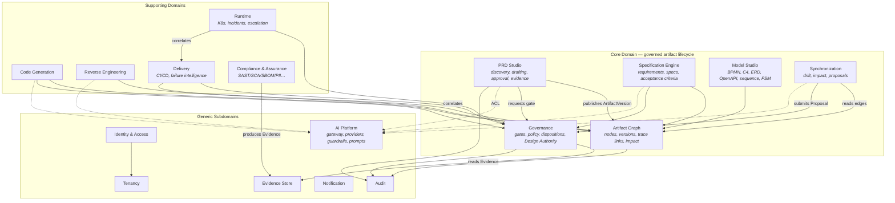

# SpecForge — Domain Model & Bounded Contexts

**Status:** Baseline v1.0
**Owner:** Design Authority

---

## 1. Ubiquitous language

| Term | Definition | Not to be confused with |
|------|-----------|------------------------|
| **Tenant** | The isolation boundary that owns everything. Every row, object, cache key, event and secret belongs to exactly one tenant. | Organization (an IdP concept mapped *into* a tenant) |
| **Project** | A delivery unit within a tenant. Owns an artifact graph. | Repository (a project may reference 0..n repositories) |
| **Artifact** | An immutable, content-addressed, versioned node in the artifact graph. | Document (a file is *evidence*, an artifact is a governed node) |
| **Artifact Version** | A specific immutable revision of an artifact, identified by `(artifact_id, version)` and pinned by `content_hash`. | Draft (a draft is a *mutable working copy*, not yet an artifact version) |
| **Working Copy** | The mutable editing surface for an artifact that is not yet frozen. Never referenced by traceability edges. | Artifact Version |
| **Trace Link** | A typed, directed, versioned edge between two artifact versions. | Foreign key |
| **Evidence** | An immutable byte-stream in object storage, referenced by digest, that substantiates a claim (approval, scan result, test report). | Log entry |
| **Disposition** | The recorded, defensible outcome of a governance decision, with reason, risk, owner, approver, evidence, expiry. | Gate result (a gate result *becomes* a disposition when recorded) |
| **Gate** | A named, policy-driven control point returning ALLOW / BLOCK / REVIEW_REQUIRED / EXCEPTION_REQUIRED. | Pipeline stage |
| **Design Authority** | The governance body (a set of principals plus its policy set) that owns architecture and governance correctness. | Architect role |
| **Drift** | A detected divergence between two artifacts that a trace link asserts should be consistent. | Change |
| **Proposal** | An AI- or analyzer-generated *candidate* change to an authoritative artifact. Requires disposition. | Patch |
| **Inference** | One governed call through the AI Gateway, recording prompt/model/guardrail versions and cost. | LLM request |
| **Guardrail** | A pluggable pre- or post-inference control with a standard interface and latency budget. | Content filter |

## 2. Strategic design — bounded context map



### 2.1 Context relationships (patterns)

| Upstream | Downstream | Pattern | Contract |
|----------|-----------|---------|----------|
| Tenancy | all | Conformist | `TenantContext` value object propagated in `context.Context` |
| Identity | all | Conformist | `Principal` + `PermissionSet` |
| Artifact Graph | PRD, Spec, Model, Gen, RE | **Published Language** | `ArtifactVersion` + `TraceLink` schemas (versioned) |
| AI Platform | PRD, Spec, Gen, RE, Sync | **Anticorruption Layer** | Each consumer owns a task-specific port; no consumer imports a provider SDK |
| Governance | all | **Open Host Service** | `GateRequest` → `GateDecision`; synchronous, idempotent |
| Delivery | Runtime | Customer/Supplier | `DeploymentRef` correlation keys |
| Compliance | Governance | Supplier | `EvidenceRef` + normalized `Finding` |
| Audit | all | Published Language (sink) | append-only `AuditRecord` |

### 2.2 Why a modular monolith

Twelve contexts do **not** imply twelve services. v1 deploys as:

- `specforge-api` — synchronous control plane hosting all contexts as internal modules with
  compile-time enforced boundaries (no cross-context package imports except through `ports`).
- `specforge-worker` — asynchronous consumers (generation, reverse engineering, drift detection,
  scans, correlation).
- `specforge-gateway` — the AI Gateway, deployed separately because it has a distinct latency
  budget, distinct scaling profile, and a distinct blast radius.

Boundaries are enforced by an import-linter check in CI (`make lint-arch`), so extraction into
separate services later is mechanical rather than archaeological.

## 3. Aggregates

Aggregate roots and their invariants. Each aggregate is a transaction boundary; cross-aggregate
consistency is eventual, via the transactional outbox.

### 3.1 Tenancy context

**`Tenant`** (root)
- Identity: `tenant_id` (UUIDv7)
- Invariants:
  - `slug` unique platform-wide, immutable after creation.
  - A tenant in `SUSPENDED` accepts no writes except by `platform_admin` break-glass.
  - Deletion is soft; hard deletion requires an executed `TenantPurgeOrder` with legal-hold check.
- Entities: `TenantSettings`, `TenantAIConfig`, `TenantPolicyBinding`, `TenantIntegration`
- Events: `tenant.created`, `tenant.suspended`, `tenant.settings.updated`

**`Project`** (root)
- Identity: `project_id`, scoped by `tenant_id`
- Invariants:
  - `key` (e.g. `PAY`) unique within tenant, immutable, used as the artifact ID namespace.
  - A project cannot be archived while it owns a non-terminal `GovernanceCase`.
- Events: `project.created`, `project.archived`

### 3.2 Identity & Access context

**`Principal`** (root) — a human user or a service account.
- Invariants: `subject` unique per `(issuer, subject)`; a principal has ≥ 0 `RoleAssignment`s.

**`RoleAssignment`** — `(principal_id, tenant_id, project_id?, role)`; `project_id = NULL` means tenant scope.

**`ApiKey`** — hashed secret, scoped to tenant + optional project + permission subset, with expiry.

### 3.3 Artifact Graph context — the core

**`Artifact`** (root) — the *identity and history* of a governed thing.
- Identity: `artifact_id` — human-meaningful, e.g. `SPEC-AUTH-001`, unique per project.
- Holds: `artifact_type`, `current_version`, `status`, ordered `versions`.
- Invariants (enforced in the aggregate, not just the DB):
  1. `artifact_id` is immutable and never reused, even after deletion.
  2. Versions are a strictly increasing, gapless integer sequence starting at 1.
  3. A version whose `status` is terminal-immutable (`APPROVED`, `FROZEN`, `SUPERSEDED`) can never
     be mutated. Any change creates version *n+1*.
  4. `content_hash = SHA-256(canonical_json(content))`; verified on read; mismatch raises
     `ErrArtifactTampered` and emits `artifact.integrity.violated`.
  5. `previous_version` forms an unbroken chain to version 1.
  6. Transition to `APPROVED` requires a non-null `ApprovalEvidence` with a resolvable digest.
  7. Approving version *n* transitions any prior `APPROVED` version to `SUPERSEDED` in the same
     transaction.

**`ArtifactVersion`** (entity, immutable once non-draft)

```
artifact_id, version, tenant_id, project_id, artifact_type, status,
content_ref (object-store digest), content_hash, canonical_schema_version,
parent_artifact_id, source_artifact_id, created_by, created_at,
approved_by, approved_at, approval_comment, approval_evidence_ref,
previous_version, change_summary, generator (prompt/model/guardrail versions or analyzer version)
```

**`TraceLink`** (root, small aggregate) — a typed directed edge.

```
link_id, tenant_id, project_id,
from_artifact_id, from_version, to_artifact_id, to_version,
link_type, confidence, origin (HUMAN|ANALYZER|LLM_PROPOSED), status (PROPOSED|ACCEPTED|REJECTED|STALE),
created_by, created_at, evidence_ref
```

- Invariant: a link with `origin = LLM_PROPOSED` may not be `ACCEPTED` without a disposition.
- Invariant: both endpoints must exist in the same `(tenant_id, project_id)`.

### 3.4 PRD Studio context

**`PrdDocument`** (root) — wraps an `Artifact` of type `PRD` and adds the discovery conversation.
- Entities: `DiscoverySession`, `ConversationTurn`, `ChangeRequest`, `IngestedDocument`.
- Invariants:
  - A `ChangeRequest` may only target a version in `USER_REVIEW` or `CHANGES_REQUESTED`.
  - Applying change requests always produces a new version; it never edits in place.
  - An `IngestedDocument` retains its original bytes and its extraction manifest forever.

### 3.5 Specification Engine context

**`Requirement`** (root) — `REQ-<AREA>-<NNN>`; the atomic statement of business need.
**`Specification`** (root) — `SPEC-<AREA>-<NNN>`; typed (`FUNCTIONAL`, `NON_FUNCTIONAL`, `SECURITY`,
`API`, `DATA`, `INTEGRATION`, `OPERATIONAL`, `COMPLIANCE`).
- Invariants:
  - Every `Specification` has ≥ 1 `AcceptanceCriterion` and ≥ 1 `derived_from` link to a `Requirement`.
  - Machine-readable payload must validate against `spec.v{n}.schema.json` before the version leaves `DRAFT`.
  - A `Specification` cannot be `APPROVED` while any linked `Requirement` version is not `APPROVED`.

### 3.6 Governance context

**`GovernanceCase`** (root) — one adjudication: a gate evaluation, an exception, a waiver, a proposal review.
- Entities: `GateEvaluation`, `PolicyResult`, `Disposition`, `Exception`, `CompensatingControl`.
- Invariants:
  - Every terminal `GovernanceCase` has exactly one `Disposition`.
  - An `Exception` must carry `expires_at`; open-ended exceptions are rejected by the policy engine.
  - A `Disposition` is append-only; correction is a new `Disposition` superseding the prior one.

**`PolicySet`** (root) — versioned, tenant-scoped bundle of gate definitions and rules.

### 3.7 Synchronization context

**`DriftFinding`** (root) — `(subject_artifact, counterpart_artifact, drift_type, severity, evidence)`.
**`ChangeProposal`** (root) — a candidate new version of a target artifact plus rationale and diff.
- Invariant: a `ChangeProposal` never writes to the target artifact; the Governance context applies it.

### 3.8 Delivery & Runtime contexts

**`Pipeline`**, **`PipelineRun`**, **`Deployment`**, **`Incident`**, **`EscalationPolicy`**.
- `PipelineRun` carries correlation keys: `commit_sha`, `branch`, `pr_number`, `artifact_refs[]`.
- `Incident` invariant: acknowledgement stops escalation; timeline entries are append-only.

### 3.9 AI Platform context

**`PromptTemplate`** (root, versioned artifact), **`ModelBinding`**, **`GuardrailChain`**,
**`InferenceRecord`** (append-only).
- Invariant: no inference executes without a resolvable `(prompt_version, model_binding, guardrail_chain_version)` triple.

### 3.10 Audit context

**`AuditRecord`** (append-only, hash-chained per tenant).
- `record_hash = SHA-256(prev_hash ‖ canonical_json(payload))`; the chain head is periodically
  anchored to object storage with an object-lock retention period, making retroactive edits
  detectable and unwritable.

## 4. Value objects

`TenantID`, `ProjectID`, `ArtifactID`, `ArtifactType`, `Version`, `ContentHash`, `EvidenceRef`,
`Principal`, `Permission`, `Role`, `LinkType`, `GateDecision`, `RiskRating`, `Severity`,
`LatencyBudget`, `TokenUsage`, `Cost`, `CorrelationKeys`.

All are immutable, validated at construction, and serialize canonically (RFC 8785 JCS) so that
hashing is stable across languages and versions.

## 5. Artifact type taxonomy

| Type | ID pattern | Produced by | Canonical representation |
|------|-----------|-------------|--------------------------|
| `REQUIREMENT` | `REQ-<AREA>-<NNN>` | Spec Engine | JSON (requirement.v1) |
| `PRD` | `PRD-<NNN>` | PRD Studio | Markdown + JSON front-matter (prd.v1) |
| `SPECIFICATION` | `SPEC-<AREA>-<NNN>` | Spec Engine | JSON (spec.v1) + rendered Markdown |
| `BPMN_PROCESS` | `BPMN-<AREA>-<NNN>` | Model Studio | BPMN 2.0 XML |
| `ARCHITECTURE` | `ARCH-<NNN>` | Model Studio | C4 model JSON + Mermaid render |
| `API_CONTRACT` | `API-<NNN>` | Model Studio | OpenAPI 3.1 / Protobuf |
| `DATA_MODEL` | `DATA-<NNN>` | Model Studio | ERD JSON + DDL |
| `SEQUENCE` | `SEQ-<NNN>` | Model Studio | Mermaid sequence AST |
| `STATE_MACHINE` | `FSM-<NNN>` | Model Studio | SCXML-subset JSON |
| `CODE_UNIT` | `CODE-<pkg>-<NNN>` | Codegen / Reverse Eng | Source ref (repo, path, symbol, commit) |
| `TEST_CASE` | `TEST-<NNN>` | Codegen / QA | Test ref + spec linkage |
| `PIPELINE_DEF` | `PIPE-<NNN>` | Delivery | Pipeline YAML |
| `DEPLOYMENT` | `DEP-<NNN>` | Delivery | Deployment manifest ref + env |
| `POLICY` | `POL-<NNN>` | Governance | Rego/CEL policy source |
| `EVIDENCE` | `EVD-<NNN>` | Compliance | Digest + metadata |
| `PROMPT` | `PRM-<NNN>` | AI Platform | Prompt template + params |

## 6. Aggregate consistency rules

1. **One aggregate per transaction.** A command mutating `Artifact` and `TraceLink` writes the
   artifact transactionally and emits `artifact.version.created`; the link is created by a handler.
   Exception: the approval transaction (§3.3 invariant 7) spans the artifact and its prior version
   because they belong to the same aggregate.
2. **Outbox always.** Every state-changing transaction writes its domain events to
   `outbox_events` in the same transaction. A relay publishes them at-least-once with the aggregate
   ID as the partition key, giving per-aggregate ordering.
3. **Idempotency.** Every command endpoint accepts `Idempotency-Key`; the key plus a hash of the
   request body is stored for 24 h with the original response.
4. **Audit is not optional.** The audit writer participates in the same transaction as the command
   for governance-relevant operations (see `docs/architecture/25-audit-scope.md`), so an operation
   that is not audited cannot commit.
