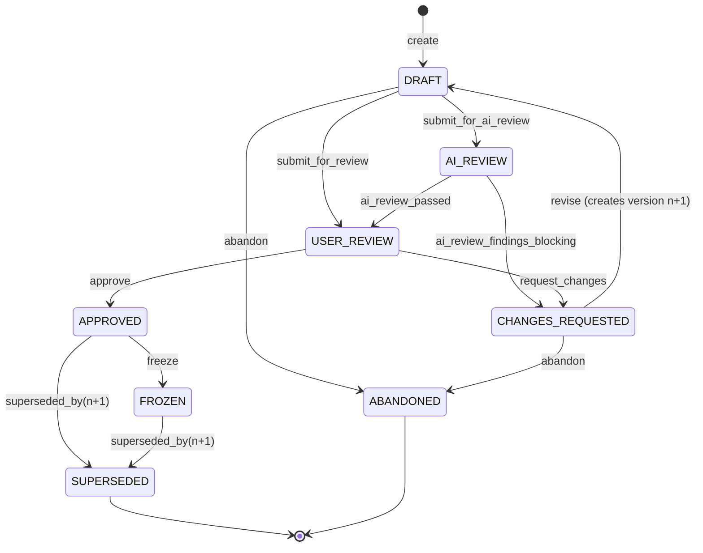
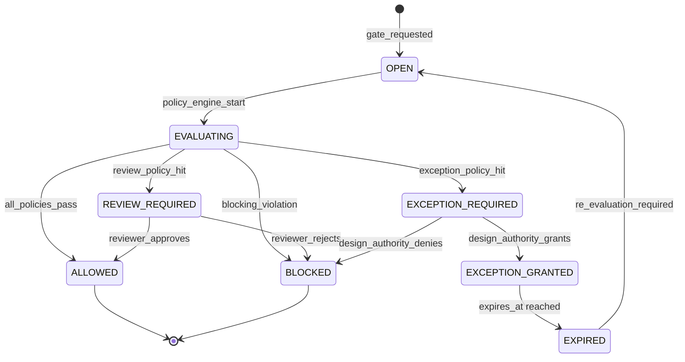
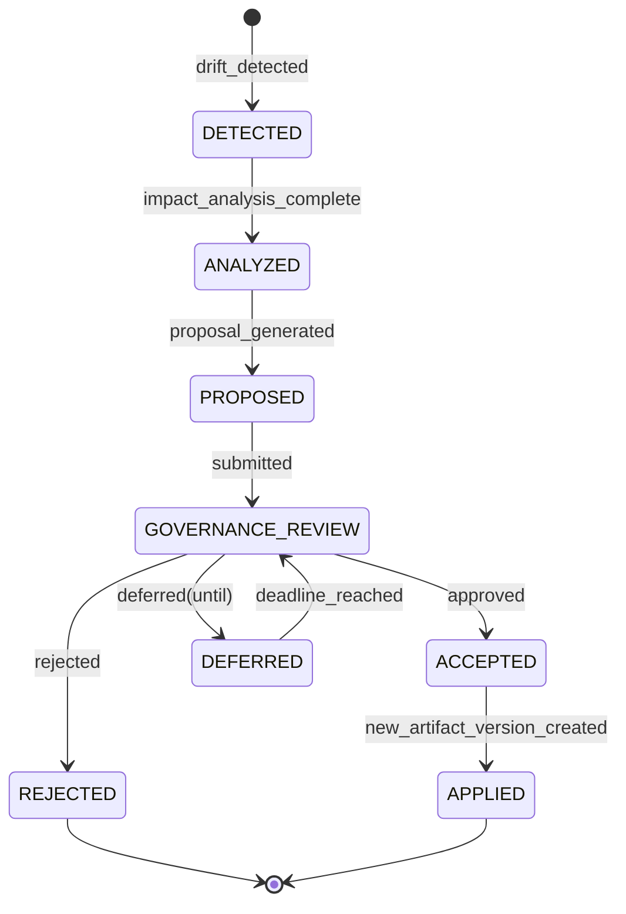
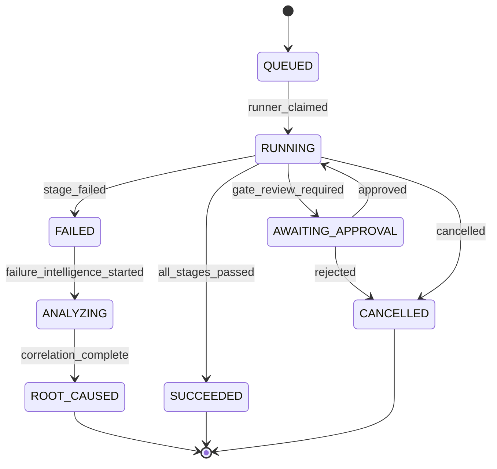
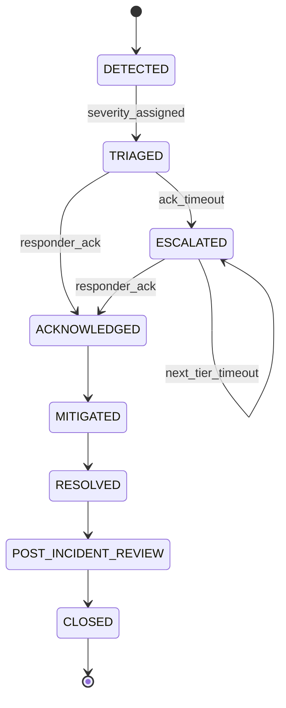
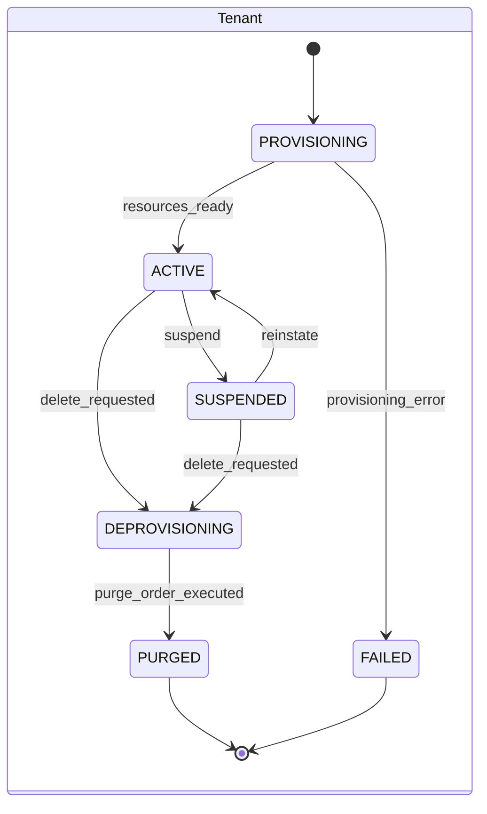
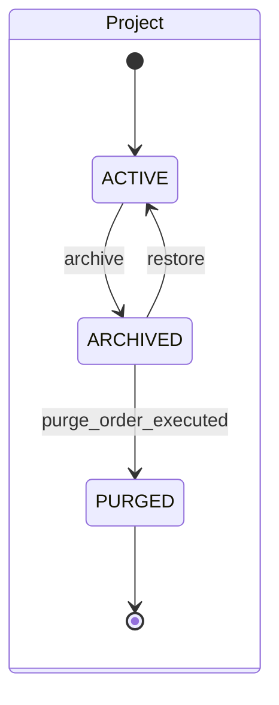
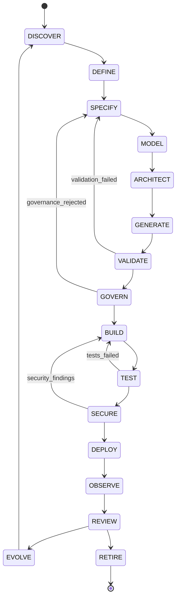
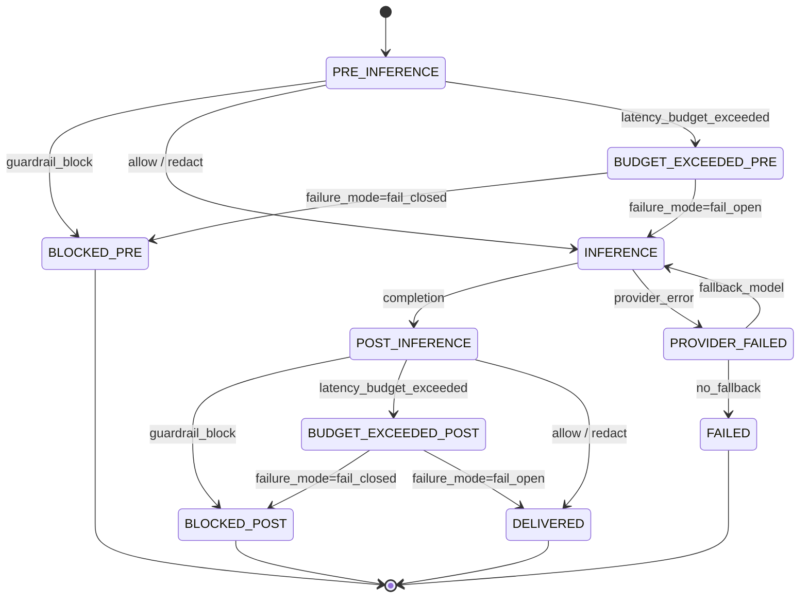

# SpecForge — State Machines

**Status:** Baseline v1.0
**Owner:** Design Authority

Every lifecycle in SpecForge is an explicit finite state machine with declared guards, effects and
required permissions. State machines are declared once, in `internal/platform/fsm`, and reused —
there is no ad-hoc `if status == "..."` branching in service code. Transitions are the only way state
changes, and every transition emits a domain event and an audit record.

---

## 1. Artifact / PRD lifecycle

The states mandated in the brief §3, generalized to all artifact types.



### 1.1 Transition table

| From | Event | To | Guards | Effects | Permission |
|------|-------|----|--------|---------|-----------|
| — | `create` | `DRAFT` | project active; artifact_id unique or next version of existing | allocate version *n*; write working copy | `artifact:create` |
| `DRAFT` | `submit_for_ai_review` | `AI_REVIEW` | content validates against `content_schema` | enqueue AI review job with guardrail chain | `artifact:submit` |
| `AI_REVIEW` | `ai_review_passed` | `USER_REVIEW` | review job completed; no blocking finding | attach `EVD` review report | system |
| `AI_REVIEW` | `ai_review_findings_blocking` | `CHANGES_REQUESTED` | ≥1 blocking finding | attach findings | system |
| `DRAFT` | `submit_for_review` | `USER_REVIEW` | schema valid | notify reviewers | `artifact:submit` |
| `USER_REVIEW` | `request_changes` | `CHANGES_REQUESTED` | comment non-empty | create `ChangeRequest` | `artifact:review` |
| `USER_REVIEW` | `approve` | `APPROVED` | **all** gates bound to this artifact type return ALLOW *or* have a valid unexpired exception; approver ≠ sole author when `four_eyes` policy on; `approval_comment` non-empty | **seal**: compute `content_hash`, persist content to WORM evidence, write `ApprovalEvidence`, supersede prior APPROVED version, emit `prd.approved` / `<type>.approved` | `artifact:approve` |
| `CHANGES_REQUESTED` | `revise` | `DRAFT` (version *n+1*) | — | create new working copy with `previous_version = n`, carry `change_summary` | `artifact:edit` |
| `APPROVED` | `freeze` | `FROZEN` | — | pin as baseline; block new versions until unfrozen by Design Authority | `artifact:freeze` |
| `APPROVED`/`FROZEN` | `superseded_by` | `SUPERSEDED` | new version approved in the same transaction | — | system |
| `DRAFT`/`CHANGES_REQUESTED` | `abandon` | `ABANDONED` | no `ACCEPTED` inbound links | — | `artifact:delete` |

### 1.2 Sealing (the approval effect, in order)

Executed in **one** database transaction plus one idempotent object-store write:

1. Re-validate payload against `content_schema`.
2. Evaluate all bound gates; require ALLOW or an unexpired `Exception` disposition.
3. Canonicalize (JCS) → compute `content_hash`.
4. `PUT` canonical bytes to WORM object storage under `sha256:<hash>` (idempotent; identical bytes
   are a no-op) with object-lock retention = tenant `evidence_retention` (default 7 y).
5. Build `ApprovalEvidence` = { artifact envelope digest, gate decisions, disposition IDs, approver
   principal, IdP token `jti` + `auth_time`, server timestamp from a monotonic trusted source,
   policy set version }. `PUT` it; record its digest.
6. `UPDATE artifacts SET status='APPROVED', approved_* = …` — permitted only from `USER_REVIEW`
   (optimistic concurrency on `(artifact_id, version, status)`).
7. Supersede prior `APPROVED` version of the same `artifact_id`.
8. Append `AuditRecord` (hash-chained) inside the same transaction.
9. Write `prd.approved` (or type-specific) event to `outbox_events` in the same transaction.

If any step fails, the transaction rolls back and the artifact stays in `USER_REVIEW`. The WORM
writes in steps 4–5 are content-addressed and therefore safe to retry and harmless if orphaned.

### 1.3 Immutability enforcement

- Application: repository exposes no `Update` for sealed statuses.
- Database: `BEFORE UPDATE` trigger on `artifact_versions` raises unless
  `OLD.status IN ('DRAFT')` or the update is a whitelisted status transition to
  `SUPERSEDED`/`FROZEN` performed by the sealing function.
- Storage: object-lock in compliance mode on the evidence bucket.
- Verification: read-path hash check + periodic sweep (see `02-canonical-artifact-model.md §8`).

---

## 2. Governance case lifecycle



Every terminal transition writes exactly one `Disposition` (see §24 of the brief) containing:
`decision, reason, risk, impact, owner, approver, evidence[], compensating_controls[], expires_at,
policy_set_version, timestamp`.

`EXCEPTION_GRANTED → EXPIRED` is driven by a scheduled worker, which re-opens the case and, if the
subject artifact is deployed, raises an incident at the configured severity.

---

## 3. Change proposal lifecycle (synchronization)



**Invariant:** `APPLIED` is reachable only from `ACCEPTED`, and applying creates a *new artifact
version* through the artifact FSM (`revise` → `DRAFT` → … ). The synchronization engine never writes
to an artifact directly. This is the mechanical expression of the brief's §9 rule *"AI proposes,
governance validates, human approves."*

---

## 4. Pipeline run lifecycle



`ANALYZING → ROOT_CAUSED` is the failure-intelligence path (brief §20): it resolves stage, job,
step, first failing commit, last successful commit, author, PR, and the affected artifact /
specification / BPMN / service set from the artifact graph.

---

## 5. Deployment lifecycle

```mermaid
stateDiagram-v2
    [*] --> PENDING
    PENDING --> GATED : production_gate_evaluating
    GATED --> DEPLOYING : gate_allowed
    GATED --> BLOCKED : gate_blocked
    DEPLOYING --> VERIFYING : rollout_complete
    VERIFYING --> HEALTHY : health_and_slo_ok
    VERIFYING --> DEGRADED : slo_breach
    DEPLOYING --> FAILED : rollout_failed
    DEGRADED --> ROLLING_BACK : auto_or_manual_rollback
    FAILED --> ROLLING_BACK : rollback
    ROLLING_BACK --> ROLLED_BACK
    HEALTHY --> SUPERSEDED : newer_deployment_healthy
    BLOCKED --> [*]
    ROLLED_BACK --> [*]
    SUPERSEDED --> [*]
```



---

## 6. Incident lifecycle



Escalation tiers, SLAs and acknowledgement timeouts are tenant-configurable
(`Warning → SRE → Engineering Lead → Architect → Incident Commander`). Every transition appends to
an append-only incident timeline that is part of the audit trail.

---

## 7. Tenant and project lifecycles





`DEPROVISIONING → PURGED` requires an executed `TenantPurgeOrder` signed by `platform_admin` **and**
`compliance`, with an automated legal-hold check that fails closed.

---

## 8. AI-PDLC phase machine

The programme-level lifecycle (brief §11). Phases are **not** strictly linear: `EVOLVE` re-enters
`DISCOVER`, and `VALIDATE`/`GOVERN` can send the project back to `SPECIFY`.



Each phase entry and exit produces a `PhaseTransition` record with the artifacts and evidence
produced in that phase, forming the project's assurance narrative.

---

## 9. Guardrail chain execution machine



`failure_mode` defaults to `fail_closed` for all guardrails handling PII or safety; `fail_open` is
permitted only for advisory guardrails and requires a recorded Design Authority disposition.

---

## 10. Implementation contract

```go
// internal/platform/fsm
type State string
type Event string

type Transition[C any] struct {
    From       []State
    Event      Event
    To         State
    Guards     []Guard[C]      // pure, side-effect free, evaluated in order
    Permission string          // checked before guards
    Effects    []Effect[C]     // executed inside the aggregate transaction
    EmitEvent  string          // domain event type
    Audit      AuditSpec       // audit action + severity
}

type Machine[C any] struct { /* … */ }

func (m *Machine[C]) Fire(ctx context.Context, ev Event, c *C) (State, error)
```

Rules enforced by the framework:

- A transition not declared in the table cannot occur; `Fire` returns `ErrIllegalTransition`.
- Guards are pure; all mutation happens in `Effects`.
- `Fire` requires an active transaction in `ctx` and refuses to run outside one.
- Every `Fire` writes exactly one audit record and at least one outbox event.
- FSM tables are covered by generated exhaustiveness tests: every state must be reachable and every
  non-terminal state must have at least one outgoing transition (CI fails otherwise).
