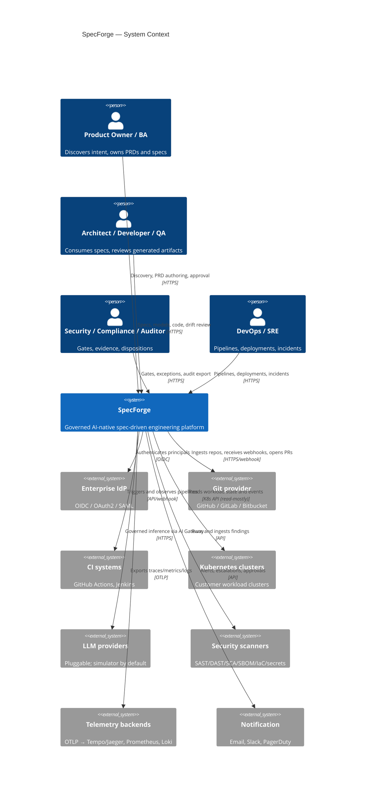
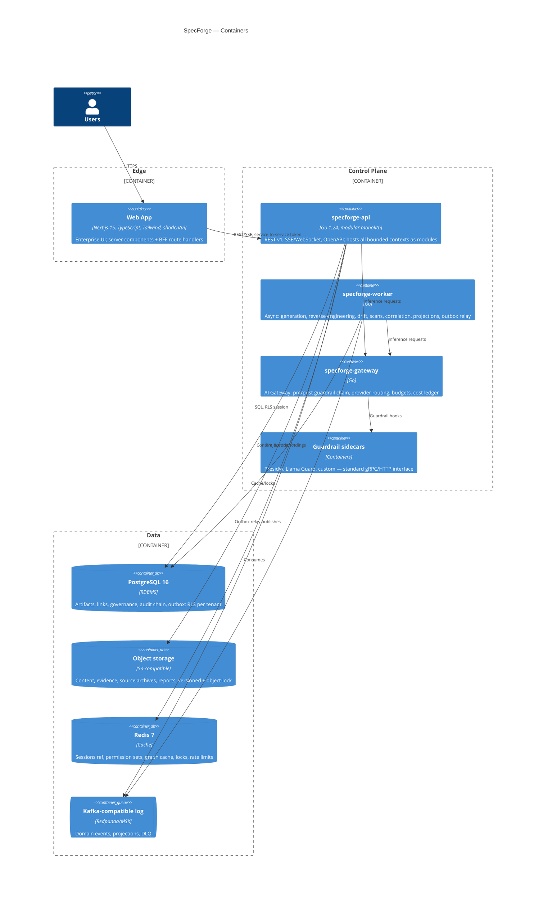
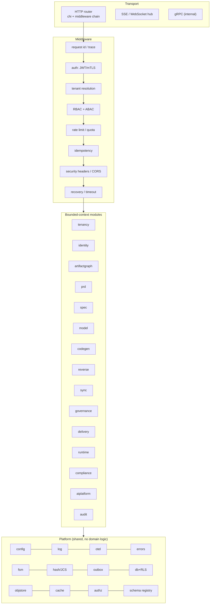
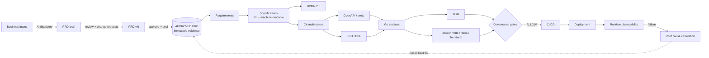
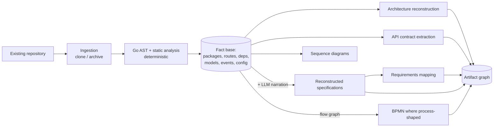
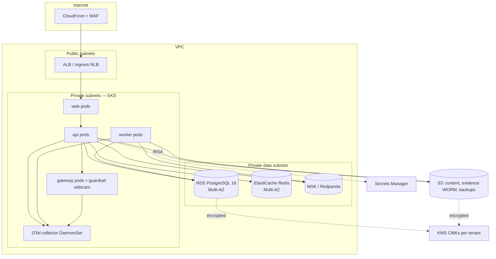

# SpecForge — High Level Design

**Status:** Baseline v1.0

---

## 1. C4 Level 1 — System context



## 2. C4 Level 2 — Containers



### 2.1 Container responsibilities

| Container | Responsibility | Scaling | Stateful? |
|-----------|---------------|---------|-----------|
| `web` | UI, BFF, session cookie ↔ token exchange, SSR | HPA on CPU/RPS | No |
| `specforge-api` | All synchronous domain operations, FSM transitions, authz, outbox writes | HPA on RPS + p95 latency | No |
| `specforge-worker` | Event consumers, long jobs (AST, generation, scans), schedulers, outbox relay | KEDA on consumer lag | No (leases in Redis) |
| `specforge-gateway` | Guardrail chain, provider adapters, budgets, circuit breakers, cost/usage ledger | HPA on inflight + p95 | No |
| Guardrail sidecars | One control each, standard interface | Independent HPA | No |

The `worker` runs multiple *roles* selected by flag (`--roles=outbox,drift,ast,scan,projection`), so
noisy neighbours can be split into separate deployments without code changes.

## 3. C4 Level 3 — `specforge-api` components



**Dependency rule:** `transport → module/application → module/domain`, and
`module/infrastructure → module/domain`. Domain packages import nothing outside the standard library
and `platform/types`. Cross-module calls go through `ports` interfaces only. Enforced by
`make lint-arch`.

## 4. Request lifecycle (representative: approve a PRD)

```mermaid
sequenceDiagram
  autonumber
  participant U as User (Web)
  participant B as BFF (Next.js)
  participant A as specforge-api
  participant G as Governance module
  participant D as PostgreSQL
  participant O as Object storage
  participant K as Event log

  U->>B: POST /prd/PRD-001/approve (cookie)
  B->>A: POST /api/v1/projects/{p}/artifacts/PRD-001/versions/4:approve (Bearer, Idempotency-Key)
  A->>A: JWT verify → tenant resolve → RBAC(artifact:approve) → step-up check
  A->>G: Evaluate bound gates (PRD_GATE, SECURITY_GATE…)
  G->>D: Load policy set + prior dispositions
  G-->>A: ALLOW (+ case IDs)
  A->>A: SoD: approver ≠ sole author
  A->>A: Canonicalize (JCS) → content_hash
  A->>O: PUT content (sha256 key, object-lock)
  A->>O: PUT approval evidence
  A->>D: BEGIN; update version→APPROVED; supersede v3; insert audit (hash-chained); insert outbox(prd.approved); COMMIT
  A-->>B: 200 {version, content_hash, evidence_ref}
  Note over A,K: Outbox relay publishes prd.approved
  A->>K: prd.approved
  K-->>A: consumers: spec generation offer, projections, notifications
```

## 5. Data flow — forward journey



## 6. Data flow — reverse journey



**Rule:** `FACTS` are produced only by deterministic analysis. The LLM may narrate, cluster and name
things, but a fact it asserts that is not in the fact base is discarded by the validator.

## 7. Deployment topology (AWS reference)



Cloud-neutral ports (`ObjectStore`, `SecretStore`, `KeyManagement`, `EventBus`, `WorkloadInspector`)
isolate every AWS-specific detail in `internal/platform/adapters/aws`. A local adapter set (MinIO,
file secrets, Redpanda, kind) implements the same ports for development.

## 8. Availability & scaling

| Concern | Approach |
|---------|----------|
| Stateless tiers | ≥ 3 replicas across AZs, PDB `minAvailable: 2`, HPA |
| Database | Multi-AZ primary + 2 read replicas; reads for projections/graph queries go to replicas with bounded staleness |
| Cache | Redis cluster mode, AZ-spread; cache loss degrades latency, never correctness |
| Event log | RF=3, `min.insync.replicas=2` |
| Object storage | Cross-region replication for evidence |
| Graph queries | Materialized closure table refreshed by projection + Redis memoization keyed by `(project, graph_version)` |
| Long jobs | Idempotent, resumable, leased; a worker crash re-runs from the last checkpoint |
| Back-pressure | Per-tenant token buckets on inference and generation; 429 with `Retry-After` |

## 9. Key architectural decisions (ADR index)

| ADR | Decision | Rationale |
|-----|----------|-----------|
| ADR-001 | Modular monolith + async worker + separate AI gateway | Twelve contexts, one team-of-teams; distributed transactions avoided; gateway split for latency/blast radius |
| ADR-002 | PostgreSQL as artifact graph store (recursive CTE + closure projection), not a graph DB | Transactional invariants and RLS matter more than traversal elegance at our depth (≤12); one fewer stateful system to secure and back up |
| ADR-003 | RLS enabled in all isolation modes | The isolation code path must never be untested in any deployment mode |
| ADR-004 | Content addressing with JCS canonical JSON | Language-independent, stable hashes; enables offline verification |
| ADR-005 | Transactional outbox over dual-write | Correctness of the audit and event record is non-negotiable |
| ADR-006 | Deterministic analyzers own facts; LLM owns narration and proposals | Brief §42; hallucinated facts would poison the authoritative graph |
| ADR-007 | Guardrails as pluggable containers behind a uniform interface | Presidio/Llama Guard/custom without gateway code changes |
| ADR-008 | BFF pattern; tokens never in browser JS | XSS cannot exfiltrate a bearer token |
| ADR-009 | Simulator provider is a first-class, shipped provider | Deterministic tests and a fully working offline demo; no "TODO: call the LLM" |
| ADR-010 | Generated code carries `@requirement/@spec` annotations | Traceability that survives outside the platform |

Full ADRs in `docs/adr/`.
