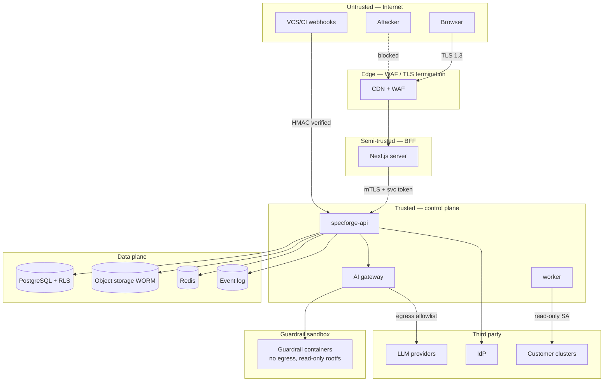

# SpecForge — Security Architecture

**Status:** Baseline v1.0
**Owner:** Enterprise Security Architect

---

## 1. Security objectives

| ID | Objective |
|----|-----------|
| SO-1 | No tenant can read, infer or influence another tenant's data through any channel — API, DB, cache, storage, events, logs, prompts, embeddings or error messages. |
| SO-2 | Approved artifacts and audit records cannot be altered undetectably, even by a privileged operator. |
| SO-3 | Every privileged action is attributable to a principal and defensible from evidence. |
| SO-4 | LLM output can never become authoritative without deterministic validation and governance. |
| SO-5 | Compromise of any single component does not yield tenant data at rest. |
| SO-6 | Secrets never exist in source, images, config files, logs or LLM prompts. |

## 2. Zero Trust posture

- **No implicit trust by network location.** Every internal call authenticates: mTLS workload
  identity (SPIFFE-style SVIDs via the mesh) plus a service token carrying the caller's identity and,
  where applicable, the delegated user principal.
- **Per-request authorization** at every hop; the API does not assume the BFF already authorized.
- **Least privilege by default**: default-deny authorization, minimal IAM roles per workload (IRSA),
  no shared database superuser, no `BYPASSRLS`.
- **Assume breach**: RLS, per-tenant encryption keys, and hash-chained audit exist specifically so
  that application-layer compromise is contained and detectable.

## 3. Trust boundaries

Boundary controls: B0→B1 WAF + rate limit + bot control; B1→B2 TLS, no direct API exposure;
B2→B3 mTLS + token; B3→B4 no network egress from guardrail containers except to the gateway;
B3→B5 network policy restricting to named services; B3→B6 explicit egress allowlist by FQDN.

## 4. Identity & authentication

Covered in `05-authorization-model.md`. Security-relevant highlights:

- OIDC with PKCE; `nonce` replay protection; JWKS pinned by issuer with rotation support.
- Only asymmetric signing algorithms accepted; `alg: none` and HMAC tokens rejected outright.
- Tokens validated for `iss`, `aud`, `exp`, `nbf`, `iat`, and the tenant claim; 60 s max skew.
- Step-up MFA required for approval, exception grant, policy change, key creation, break-glass.
- API keys: 32-byte random secret, argon2id-hashed, prefix-identified, rotatable, expiring, scoped.
- Browser never holds a bearer token (BFF pattern), so XSS cannot exfiltrate credentials.

## 5. Data protection

| Data | At rest | In transit | Notes |
|------|---------|-----------|-------|
| Database | AES-256, KMS CMK; per-tenant data key in `dedicated`/`single_tenant` modes | TLS 1.3, `verify-full` | Backups encrypted with the same CMK |
| Object storage | SSE-KMS; **object-lock (compliance mode)** on the evidence bucket | TLS 1.3 | Versioning on; lifecycle to cold storage, never expiry while under retention |
| Redis | Encryption at rest + in transit; AUTH; no persistence of sensitive values | TLS | Only derived/cacheable data; never raw artifact content |
| Event log | Encrypted at rest, TLS + SASL | TLS | Payloads exclude secrets and raw PII |
| Backups | Encrypted, cross-region, restore-tested quarterly | TLS | See `22-disaster-recovery.md` |
| Logs | No secrets, no raw PII; structured fields pass through a redactor | TLS to collector | |

**Field-level protection:** fields tagged `sensitive:"pii"` are encrypted with a per-tenant data key
before storage and are excluded from indexes, logs, events and LLM prompts unless a policy explicitly
permits. `sensitive:"secret"` fields are never persisted — only references to the secret store.

## 6. Secret management

- `SecretStore` port with AWS Secrets Manager, Vault and file-based (local dev) adapters.
- Config references secrets as `secret://path#key`; resolution happens at startup and on rotation
  notification. No secret is ever written to a config file, an image layer, or an environment
  variable in a manifest (only the *reference* is).
- Rotation: dual-read window; the app accepts old and new credentials during rotation.
- Detection: `gitleaks` in pre-commit and CI; a positive finding fails the build. The Secret Gate
  blocks any deployment whose image or manifests contain a detected secret.
- The AI Gateway holds provider credentials; no other component can call an LLM provider directly
  (egress network policy enforces this, not just convention).

## 7. Application security controls

| Control | Implementation |
|---------|---------------|
| Input validation | Schema validation at the transport edge; strict unknown-field rejection; per-type domain validators |
| Output encoding | React escapes by default; no `dangerouslySetInnerHTML` without a sanitizer allowlist (enforced by lint rule) |
| SQL injection | Parameterized queries only; `pgx` with no string concatenation; `make lint-sql` forbids `fmt.Sprintf` in query construction |
| SSRF | Repository/webhook/URL fetchers use an allowlist + DNS-rebinding-safe dialer that re-resolves and blocks private/link-local ranges at connect time |
| Path traversal | Archive extraction uses a hardened untar that rejects `..`, absolute paths, symlinks and device files, with a decompression bomb limit |
| Deserialization | JSON only; no gob/pickle from untrusted sources |
| XXE | BPMN/XML parsed with entity expansion and external DTDs disabled |
| CSRF | BFF uses `SameSite=Lax` cookies + double-submit token on state-changing form posts |
| Clickjacking | `frame-ancestors 'none'` |
| Dependency risk | SCA on every build; SBOM published per artifact; blocked on known-exploited or critical CVEs without an exception |
| Container | Distroless base, non-root UID, read-only rootfs, no capabilities, seccomp `RuntimeDefault`, signed images (cosign) verified by admission policy |
| Rate limiting / DoS | Per-principal and per-tenant token buckets; body size caps; query depth/complexity caps on graph traversal |

## 8. Malicious input handling

The platform ingests hostile-by-assumption content: uploaded PRDs, cloned repositories, LLM output.

| Source | Threat | Control |
|--------|--------|---------|
| Uploaded documents | Macro/exploit payloads, zip bombs, XXE, embedded scripts | Type sniffing (not extension), size caps, parse in a sandboxed worker with no network and a CPU/memory cap, decompression ratio limit, AV scan hook, strip active content |
| Cloned repositories | Malicious build hooks, symlink escapes, huge files, secrets | Clone with `--no-local`, never execute repository code during analysis (AST only, no `go generate`, no build), sandboxed filesystem, size/file-count caps |
| Prompt injection from documents/code | Instructions embedded in ingested content that try to redirect the model | Content is passed as *data* in a delimited, labelled channel, never as instructions; system prompt states the data channel is untrusted; a pre-inference guardrail scans for injection patterns; **output is schema-validated**, so an injected instruction cannot produce a valid-but-malicious artifact without also satisfying the schema and the governance gate |
| LLM output | Hallucinated facts, unsafe content, exfiltration attempts | Schema validation, fact cross-check against the deterministic fact base, post-inference guardrails, no tool execution from raw model text — tools are invoked only through a typed, allowlisted function interface with per-tool authorization |

## 9. AI-specific security (brief §37)

| Risk | Control |
|------|---------|
| Prompt injection | §8; plus per-tool authorization checks that re-verify the *user's* permissions, not the agent's |
| Data leakage to providers | Per-tenant policy: allowed providers, allowed regions, retention flags; PII redaction pre-inference (Presidio) with the mapping held only in memory for re-hydration; provider calls carry no tenant identifiers |
| Cross-tenant leakage | Prompt assembly is tenant-scoped by construction; caches and vector stores are namespaced per tenant; a cache key cannot be built without a tenant ID; embeddings are stored in per-tenant collections |
| Hallucination | Deterministic fact base authoritative; schema validation; citations required for claims about code; unverifiable claims are dropped by the validator, not merely flagged |
| Tool abuse | Allowlisted tools per prompt template; per-tool permission checks; no shell, no arbitrary HTTP, no direct DB access from tools |
| Unsafe output | Llama Guard (or equivalent) post-inference; blocked outputs are recorded with a reason code and never persisted as artifact content |
| Model supply chain | Model bindings are versioned and pinned; a model change is a governance event requiring a disposition |

## 10. Detection & response

- **Security events** are first-class domain events: `security.tenant_mismatch`,
  `security.breakglass.granted`, `artifact.integrity.violated`, `audit.chain.verification.failed`,
  `ai.policy.violation.detected`, `guardrail.circuit_opened`.
- All are exported to the customer's SIEM through `sf.audit.v1` and the OTLP log pipeline.
- Automatic incident creation at CRITICAL severity for integrity and audit-chain violations, with
  escalation per `22 / §escalation` policy.
- Anomaly signals: unusual approval velocity, off-hours break-glass, permission-set growth, sudden
  inference cost spike, mass artifact export.

## 11. Compliance mapping (summary)

| Framework | Where satisfied |
|-----------|----------------|
| SOC 2 CC6 (logical access) | §4, `05-authorization-model.md` |
| SOC 2 CC7 (monitoring) | §10, `18-observability-architecture.md` |
| SOC 2 CC8 (change management) | Governance gates, dispositions, immutable approvals |
| ISO 27001 A.8/A.9/A.12 | §5–§8 |
| GDPR Art. 5/25/32 | Field-level encryption, PII redaction, per-tenant keys, retention policy, purge orders |
| GDPR Art. 17 (erasure) | Purge order workflow with legal-hold check; evidence retention documented as a legal-basis exception |
| EU AI Act (transparency/record-keeping for AI systems) | Prompt/model versioning, inference records, evaluation results, human oversight in governance gates |
| NIST SSDF | SAST/SCA/SBOM/signing gates, traceability from requirement to deployed artifact |

## 12. Security testing

- Unit/negative tests for every authorization rule and every isolation boundary (`08-lld.md §11`).
- **Isolation test suite**: a per-release suite that creates two tenants and attempts, for every
  endpoint, to access tenant B's resources with tenant A's credentials — asserting 403/404 and zero
  rows at the DB layer.
- Fuzzing: document parsers, archive extraction, BPMN/XML parsing, JCS canonicalization.
- SAST + secret scanning on every commit; DAST against a deployed ephemeral environment nightly.
- Dependency and container scanning gated at CI; SBOM attached to every release.
- Annual third-party penetration test; findings tracked as governance cases with dispositions.
