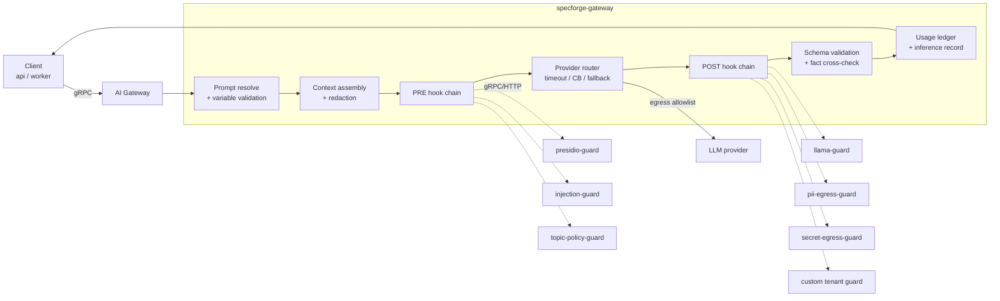

# SpecForge — AI Guardrail Platform Architecture

**Status:** Baseline v1.0
Implements brief §16.

---

## 1. Topology



Guardrails run as **separate containers** — sidecars in the gateway pod for latency-critical ones,
or independent deployments for heavier models (Llama Guard). They have **no network egress** except
back to the gateway, a read-only root filesystem, no capabilities, and CPU/memory limits.

## 2. Standard guardrail interface

Every guardrail — first-party or customer-supplied — implements one contract. The gateway knows
nothing about a guardrail's internals.

```protobuf
service Guardrail {
  rpc Describe (DescribeRequest) returns (Descriptor);
  rpc Inspect  (InspectRequest)  returns (Verdict);
  rpc Health   (HealthRequest)   returns (HealthStatus);
}

message Descriptor {
  string id = 1;             // "presidio-pii"
  string version = 2;        // semantic version of the guardrail implementation
  Stage  stage = 3;          // PRE | POST | BOTH
  repeated string categories = 4;   // "pii", "prompt_injection", "toxicity", "secrets", ...
  bool   supports_redaction = 5;
  int32  typical_latency_ms = 6;
}

message InspectRequest {
  string  inference_id = 1;
  Stage   stage = 2;
  string  purpose = 3;
  Content content = 4;               // prompt (PRE) or completion (POST), plus data-channel labels
  Config  config = 5;                // tenant-scoped guardrail configuration
  int32   budget_ms = 6;             // remaining budget; the guardrail must self-limit
}

message Verdict {
  string guardrail_id = 1;
  string guardrail_version = 2;
  Action action = 3;                 // ALLOW | REDACT | BLOCK | FLAG
  string reason_code = 4;            // stable, e.g. "pii.national_id_detected"
  float  score = 5;
  repeated Finding findings = 6;     // category, span, entity type, confidence
  Content redacted = 7;              // present when action = REDACT
  int32  latency_ms = 8;
}
```

An HTTP/JSON binding of the same contract is provided for guardrails that cannot speak gRPC.

## 3. Chain configuration

```yaml
guardrail_chain:
  id: GRC-strict
  version: 2
  budget:
    total_pre_ms: 100          # hard ceiling for the whole PRE chain
    total_post_ms: 150
  pre:
    - guardrail: presidio-pii
      timeout: 50ms
      max_latency: 100ms
      on_finding: redact        # redact | block | flag
      failure_mode: fail_closed
      circuit_breaker: { threshold: 0.5, window: 20, cooldown: 30s }
      required: true
    - guardrail: injection-guard
      timeout: 30ms
      on_finding: block
      failure_mode: fail_closed
      required: true
    - guardrail: topic-policy
      timeout: 20ms
      on_finding: block
      failure_mode: fail_open   # advisory only — requires a Design Authority disposition
      required: false
  post:
    - guardrail: llama-guard
      timeout: 120ms
      max_latency: 150ms
      on_finding: block
      failure_mode: fail_closed
      required: true
    - guardrail: secret-egress
      timeout: 30ms
      on_finding: block
      failure_mode: fail_closed
      required: true
    - guardrail: pii-egress
      timeout: 40ms
      on_finding: redact
      failure_mode: fail_closed
      required: true
```

The example from the brief (`timeout: 50ms / max_latency: 100ms / fallback: block /
failure_mode: fail_closed`) is expressible verbatim; `fallback` maps to `on_timeout` behaviour
derived from `failure_mode`.

**`fail_open` requires a recorded Design Authority disposition** with an expiry. The gateway refuses
to load a chain that sets `fail_open` on a guardrail in the `pii`, `secrets` or `safety` categories
without a valid disposition ID — a configuration error cannot silently weaken safety.

## 4. Execution semantics

### 4.1 Latency budget

- The chain has a total budget. Each guardrail receives `budget_ms` = remaining budget, and a
  per-guardrail `timeout` (the smaller of its configured timeout and the remaining budget).
- Independent guardrails in the same stage run **concurrently** (`errgroup` with a shared deadline);
  order matters only for redaction chains, which run sequentially with the redacted output feeding
  forward. The chain declares which guardrails are order-dependent.
- If the stage budget is exhausted, remaining guardrails are not called and the stage resolves per
  the strictest `failure_mode` among the skipped required guardrails.

### 4.2 Verdict combination

Precedence: `BLOCK` > `REDACT` > `FLAG` > `ALLOW`. Any required guardrail returning `BLOCK` blocks.
Redactions compose in declared order. Flags are recorded and surfaced but do not stop the request.

### 4.3 Failure handling

| Situation | `fail_closed` | `fail_open` |
|-----------|--------------|-------------|
| Guardrail timeout | BLOCK, `reason_code=guardrail.timeout` | ALLOW, `FLAG` recorded |
| Guardrail unreachable | BLOCK | ALLOW + `FLAG` |
| Circuit open | BLOCK | ALLOW + `FLAG` |
| Malformed verdict | BLOCK (always — a broken guardrail is never trusted) | BLOCK |

Every one of these emits `guardrail.timeout` / `guardrail.circuit_opened` / `inference.blocked` and
increments `sf_ai_guardrail_blocks_total{guardrail,stage,reason}`.

### 4.4 What a blocked request returns

```json
{ "type":"https://specforge.io/problems/guardrail-blocked",
  "title":"Request blocked by guardrail", "status":422,
  "code":"guardrail.blocked",
  "detail":"Content contains personal data that policy forbids sending to this provider.",
  "guardrail":"presidio-pii", "reason_code":"pii.national_id_detected",
  "inference_id":"inf_…", "trace_id":"…" }
```

The block reason is returned to the user but the *matched content* is not echoed back — echoing it
would defeat the redaction.

## 5. Shipped guardrails

| ID | Stage | Category | Implementation |
|----|-------|----------|---------------|
| `presidio-pii` | PRE/POST | pii | Microsoft Presidio analyzer + anonymizer in a container; reversible tokenization held in gateway memory only for the request lifetime |
| `injection-guard` | PRE | prompt_injection | Deterministic pattern set + classifier; scores instruction-like content inside declared data channels |
| `secret-egress` | PRE/POST | secrets | High-entropy + known-format detectors (gitleaks rule set) |
| `topic-policy` | PRE | policy | Tenant-configured allowed/blocked purposes and topics |
| `llama-guard` | POST | safety | Llama Guard served locally; categories mapped to tenant policy |
| `schema-guard` | POST | integrity | Validates output against the declared response schema (built into the gateway, listed here for completeness) |
| `grounding-guard` | POST | hallucination | Cross-checks factual claims about code/artifacts against the deterministic fact base; drops ungrounded claims |
| `cost-guard` | PRE | quota | Rejects requests that would exceed the tenant budget |

Customers add their own by shipping a container implementing §2 and registering it in the tenant's
chain; no gateway change is needed.

## 6. Versioning

- Guardrail **implementations** are versioned containers (`presidio-pii:2.3.1`).
- Guardrail **chains** are versioned configuration artifacts (`GRC-strict@v2`) in the artifact graph,
  approved through governance.
- Every inference records `guardrail_chain_version` and each verdict records `guardrail_version`, so
  a past decision can be explained with the exact controls that were in force.
- Chain changes are governance events (`policy.updated`), require approval, and are audited.

## 7. Testing guardrails

| Test | Purpose |
|------|---------|
| Contract tests | Every guardrail container is tested against a shared conformance suite (descriptor correctness, verdict shape, budget respect, health) |
| Golden corpora | Known-PII, known-injection, known-unsafe and known-benign corpora with expected verdicts; regressions fail CI |
| Latency budget tests | Assert the chain respects `total_pre_ms`/`total_post_ms` under injected guardrail slowness |
| Failure-mode tests | Kill/slow/garble a guardrail and assert `fail_closed` blocks and `fail_open` flags |
| Bypass tests | Attempt to call the provider without the chain (direct network path) → asserted blocked by network policy in the cluster test |
| False-positive budget | Benign corpus must not exceed the configured FP rate; exceeding it blocks a chain publication |

## 8. Observability

Spans per guardrail (`ai.guardrail.pre.presidio-pii`) with `guardrail.id`, `guardrail.version`,
`guardrail.action`, `guardrail.reason_code`, `guardrail.latency_ms`, `guardrail.budget_remaining_ms`.

Dashboards: block rate by guardrail and reason, p50/p95/p99 per guardrail, budget-exhaustion rate,
circuit state, false-positive reports from users, cost of guardrail compute per 1k inferences.

Alerts: block rate step change (possible attack or a broken guardrail), budget exhaustion > 1%,
circuit open > 5 min, `fail_open` active on a safety-category guardrail.
