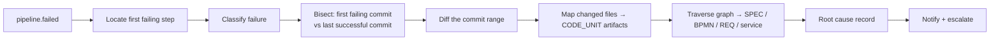

# SpecForge — CI/CD Architecture & Failure Intelligence

**Status:** Baseline v1.0
Implements brief §19, §20.

---

## 1. Two pipelines, one model

SpecForge deals with pipelines in two distinct roles:

1. **The platform's own pipeline** — how SpecForge itself is built, tested and released.
2. **Generated/managed pipelines** — pipelines SpecForge generates for customer projects and then
   observes, correlates and governs.

Both are represented in the artifact graph as `PIPELINE_DEF` artifacts and both emit the same
`pipeline.*` events, so failure intelligence works identically.

## 2. Canonical pipeline model

Provider-neutral, so GitHub Actions and Jenkins are adapters, not forks of the design.

```yaml
pipeline:
  id: PIPE-0007
  project: PAY
  stages:
    - { id: checkout,        type: SCM }
    - { id: build,           type: BUILD }
    - { id: unit_test,       type: TEST,  subtype: UNIT }
    - { id: integration_test,type: TEST,  subtype: INTEGRATION, services: [postgres, redis] }
    - { id: contract_test,   type: TEST,  subtype: CONTRACT }
    - { id: sast,            type: SCAN,  tool: semgrep,  gate: SECURITY_GATE }
    - { id: sca,             type: SCAN,  tool: osv-scanner, gate: SECURITY_GATE }
    - { id: sbom,            type: SCAN,  tool: syft, output: cyclonedx }
    - { id: container_build, type: BUILD, subtype: IMAGE, sign: cosign }
    - { id: container_scan,  type: SCAN,  tool: trivy, gate: DEPLOYMENT_GATE }
    - { id: iac_scan,        type: SCAN,  tool: checkov, gate: DEPLOYMENT_GATE }
    - { id: compliance,      type: GATE,  gate: COMPLIANCE_GATE }
    - { id: approval,        type: APPROVAL, approvers: [devops, security], four_eyes: true }
    - { id: deploy,          type: DEPLOY, target: k8s, strategy: rolling }
    - { id: verify,          type: VERIFY, checks: [health, slo_window, smoke] }
```

Each stage declares its inputs, outputs, evidence and (optionally) the governance gate it feeds.
Adapters translate this to `.github/workflows/*.yml` or a `Jenkinsfile`, and translate their
webhooks back into canonical `pipeline.*` events.

## 3. Provider adapters

| Concern | GitHub Actions | Jenkins |
|---------|---------------|---------|
| Trigger | `workflow_dispatch` / `repository_dispatch` via GitHub App | Job trigger via API token |
| Auth | GitHub App installation token (short-lived), OIDC to cloud (no static keys) | API token in secret store; agent-side OIDC |
| Events in | Webhook `workflow_run`, `workflow_job`, `check_run` | `notifyEndpoint` post-build step + polling fallback |
| Logs | Actions logs API (streamed, retained by digest) | Blue Ocean/console API |
| Gate integration | `check_run` created by SpecForge, blocking merge | Pipeline `input` step calling the gate API |
| Approval | Environment protection rules mirrored from SpecForge policy | `input` step with SpecForge-issued approval token |
| Artifacts/evidence | Uploaded to object storage by a shared action | Same, via a shared library step |

Both adapters are **read-mostly on the customer's system**: SpecForge triggers and observes, but the
customer's CI remains the execution authority. Webhooks are HMAC-verified, de-duplicated and
processed asynchronously.

## 4. Failure intelligence (brief §20)

"Pipeline failed" is useless. The failure analyzer produces a structured root cause.

### 4.1 Data captured per run

```
run: id, pipeline, number, trigger, actor, branch, pr_number, commit_sha, started_at, finished_at
stages[]: id, status, started_at, finished_at
  jobs[]: id, runner, status
    steps[]: id, name, status, exit_code, started_at, finished_at, log_ref (digest)
environment: env name, image digests, dependency lockfile digest, config digest
artifacts: sbom_ref, scan_refs[], test_report_refs[], coverage_ref
```

### 4.2 Analysis pipeline



- **Locate**: first step with a non-zero exit in topological order, ignoring downstream cascades.
- **Classify**: deterministic matchers over exit code, step type and log patterns, into a taxonomy:
  `COMPILE_ERROR, TEST_FAILURE, FLAKY_TEST, DEPENDENCY_RESOLUTION, MIGRATION_FAILURE,
  INFRA_TIMEOUT, RESOURCE_EXHAUSTED, PERMISSION_DENIED, SCAN_FINDING, GATE_BLOCKED,
  CONFIG_ERROR, EXTERNAL_SERVICE`. An LLM may *summarize* the log, but classification and all
  identifiers come from deterministic matching.
- **Flaky detection**: a test that has passed and failed on the same commit within the retention
  window is marked flaky; flakiness is tracked per test with a quarantine policy rather than being
  reported as a root cause.
- **Bisect**: last successful run's commit → first failing run's commit gives the suspect range; if
  the range has more than one commit, the analyzer ranks suspects by overlap between the failing
  test/step and the files each commit touched.
- **Correlate**: changed files → `CODE_UNIT` → `SPEC`/`REQ`/`BPMN` via the artifact graph.

### 4.3 Root cause output

Exactly the shape the brief asks for:

```
Pipeline #1842                    FAILED
Stage:        Integration Tests
Job:          integration (ubuntu-24.04)
Step:         make migrate-test
Error:        pq: column "tenant_id" of relation "specifications" already exists
Timestamp:    2026-08-20T02:41:19Z
Environment:  ci-ephemeral-1842
Classification: MIGRATION_FAILURE

Commit:       a91f823  "add tenant scoping to specifications"  (author: j.pereira)
Branch:       feature/spec-tenant-scope     PR: #418
First failing commit:  a91f823
Last successful commit: 7c02de1

Affected artifacts:
  SPEC-TENANT-004   Multi-tenant specification storage    (via CODE-spec-repo-002)
  BPMN-PROC-002     Specification approval process        (via SPEC-TENANT-004)
  Service:          tenant-service
Suggested remediation:
  Migration 0042 duplicates a column added in 0039. Squash or guard with IF NOT EXISTS.
```

Every element above is a link in the UI: the step opens the log slice, the commit opens the diff,
the artifacts open in the Artifact Explorer with the traversal path highlighted.

### 4.4 Storage

`pipeline_runs`, `pipeline_stages`, `pipeline_jobs`, `pipeline_steps`, `failure_analyses`.
Logs are stored by digest in object storage with tenant-scoped keys and a retention policy; only
the relevant slice (±200 lines around the failure) is indexed for search.

## 5. The platform's own pipeline

`.github/workflows/ci.yml` stages, all required for merge:

1. `lint` — `gofmt -l`, `go vet`, `golangci-lint`, `make lint-arch` (import boundaries),
   `make lint-routes` (every route declares a permission), `make lint-sql`.
2. `schemas` — regenerate types from `schemas/`, fail on drift; validate all example artifacts.
3. `openapi-verify` — handlers vs. `api/openapi/specforge.v1.yaml`, fail on drift.
4. `unit` — `go test ./... -race -short -coverprofile`.
5. `integration` — testcontainers: Postgres, Redis, Redpanda, MinIO. Includes the **RLS isolation
   suite** and the **audit chain tamper tests**.
6. `frontend` — `pnpm lint`, `tsc --noEmit`, `pnpm test`, `pnpm build`.
7. `security` — gitleaks, semgrep, osv-scanner, `govulncheck`.
8. `sbom` — syft → CycloneDX, attached to the run.
9. `image` — multi-arch build, distroless, non-root, cosign sign + attest SBOM.
10. `container-scan` — trivy, fail on CRITICAL/HIGH without an exception.
11. `iac` — checkov on Helm/Terraform, `helm lint`, `terraform validate`, `kubeconform`.
12. `e2e` — docker-compose stack + seeded demo tenant + journey script.
13. `release` — on tag: publish image, chart, SBOM, provenance (SLSA attestation), changelog.

Jenkins parity is provided by `ci/Jenkinsfile` using the same `make` targets, so the two never drift
in behaviour — the Makefile is the contract.

## 6. Deployment strategy

| Environment | Strategy | Gate | Rollback |
|-------------|----------|------|----------|
| dev | rolling, auto on merge | CODE_GOVERNANCE | automatic on failed health |
| staging | rolling, auto | TESTING + SECURITY | automatic |
| prod | rolling with surge 25%/unavailable 0, or canary (10% → 50% → 100% with SLO checks between) | PRODUCTION_GATE + human approval | automatic on SLO breach in the verification window; manual `deployment:rollback` otherwise |

Database migrations use the expand/contract pattern with a mandatory two-release window between
expand and contract, so a rollback never lands on an incompatible schema. The migration runner takes
an advisory lock and is safe to run from multiple pods.

## 7. Supply chain

- Every image is signed with cosign and carries an SBOM attestation and SLSA provenance.
- Admission policy in the cluster verifies the signature and the provenance issuer; unsigned or
  unattested images are rejected at admission, not merely warned about.
- Dependency pinning: `go.mod` + `go.sum` verified, `GOFLAGS=-mod=readonly`, `pnpm-lock.yaml`
  frozen, base images pinned by digest.
- A dependency update is a PR that must pass the same gates; automated updates are allowed only for
  patch versions with no new transitive dependencies.
